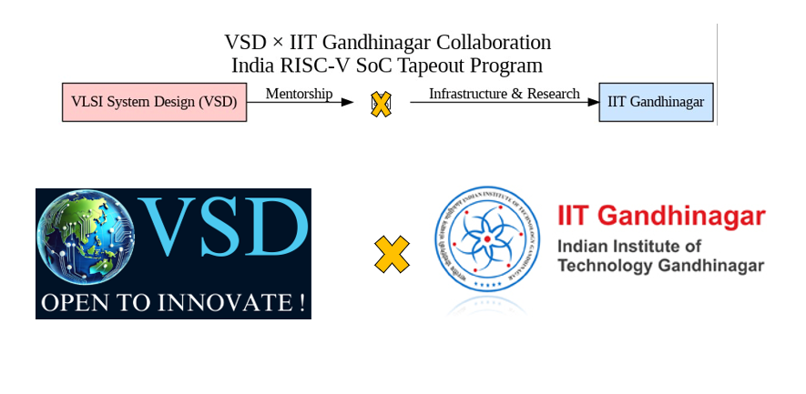
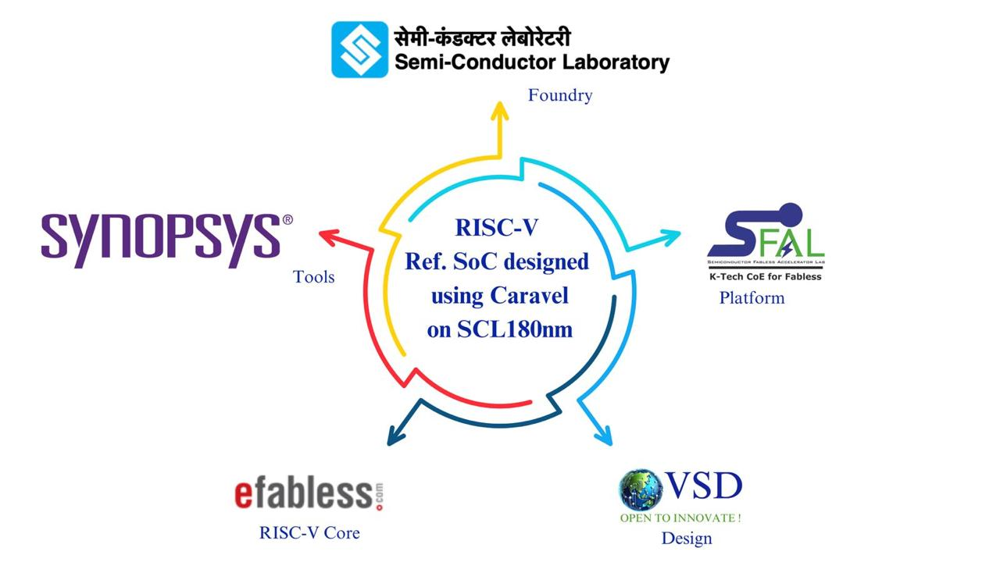
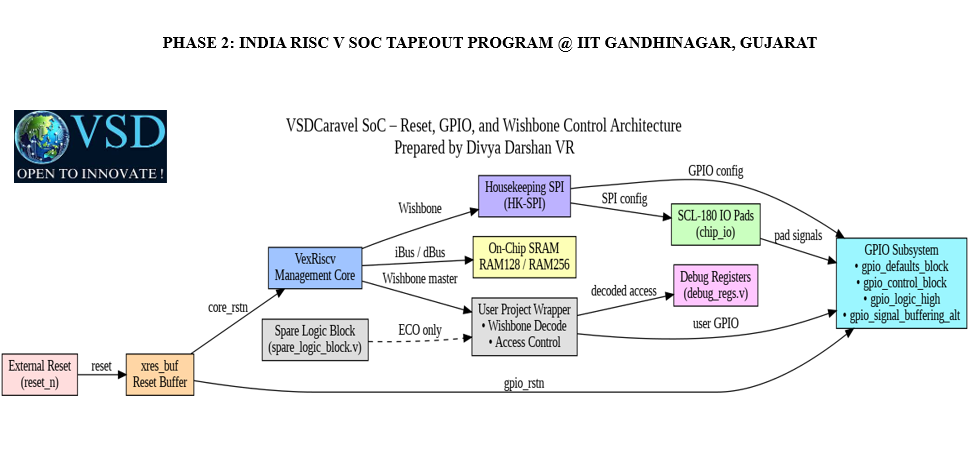

# India RISC-V SoC Tapeout Program - Phase 2 

<p align="center">
  
  
  
  
  
</p>


 <p align="center">
 <strong>🚀Great engineers are not defined by what works in simulation, but by what continues to work when assumptions are removed.</strong>
 </P>
 

<br><br><br>

<p align="center">
  
</p>

---

## Overview

- This document presents a **comprehensive technical summary** of the work I carried out during **Phase-2 of the India RISC-V Tapeout Program**, conducted by **VLSI System Design (VSD)** in collaboration with **IIT Gandhinagar**.

- Phase-2 marked a decisive transition from **guided execution** to **research-driven, industry
style engineering**, covering:-
 
* Full SoC functional simulation 
* Gate-level simulation (GLS) 
* Synopsys-only tool migration
* POR removal and reset re-architecture 
* Management SoC DV validation
* ICC2 floorplanning
* Deep RTL module-level debugging and verification

- Beyond mandatory tasks, I independently analyzed and verified **multiple core RTL modules**, strengthening my understanding of **reset correctness, Wishbone protocol behavior, GPIO architecture, pad-level logic, and SoC integration**.

---
## 📌 Program Poster



---
## 🏗️ VSDCaravel SoC – Reset, GPIO, and Wishbone Control Architecture
*Prepared by Divya Darshan VR*




* This architectural view highlights the exact subset of the `VSDCaravel SoC` that I worked on during `Phase-2`, focusing on `reset architecture`, `GPIO subsystem behavior`, `Wishbone` access control, and debug integration.  
* DV/testbench logic and unrelated SoC blocks are intentionally excluded.


<p align="center">
<strong>This architecture view highlights the exact control-plane and integration blocks I worked on in VSDCaravel, not the complete SoC.</strong>
</p>
 
---
## Environment & Toolchain
### Process Technology
```bash
 PDK: SCL-180 (180nm CMOS)
 ```
---
### Synopsys Toolchain
| Stage | Tool |
|-----|-----|
| Functional Simulation | Synopsys VCS |
| Synthesis | Synopsys DC_SHELL |
| Gate-Level Simulation | Synopsys VCS |
| waveform | Gtkwave |
| Floorplanning | Synopsys ICC2 |
| Placement | Synopsys ICC2 |
| CTS | Synopsys ICC2 |
| Routing | Synopsys ICC2 |
| SPEF Analysis | Synopsys Star RC |
| STA | Synopsys Prime Time |

---

### Engineering Mode

- Research-driven execution
- Synopsys SolvNet actively used
- No open-source simulators in final flow

---
# 🧩 Task-0 (Day-1): Caravel SoC HK-SPI Verification (RTL + GLS)

### 🎯 What I Did

- Set up the complete **Caravel SoC verification environment** on a Linux system
- Installed and validated the **Sky130 PDK using Volare**, ensuring:
  - Correct PDK version selection
  - Proper environment variable configuration
- Studied the **Caravel SoC architecture**, with focus on:
  - Management RISC-V SoC
  - Housekeeping SPI (HK-SPI)
  - GPIO and user-project control paths
- Identified **HK-SPI** as the primary bring-up and configuration interface
- Ran the **HK-SPI design-verification test** at:
  - RTL level
  - Gate-Level Simulation (GLS) level
- Debugged and resolved multiple integration issues:
  - Missing or duplicated RTL modules
  - Incorrect include paths
  - Missing VexRiscv CPU RTL
  - GLS black-box and filler-cell issues

### 🧠 What I Learned

- HK-SPI is the **core configuration bridge** between the management SoC and the rest of Caravel
- Caravel DV tests are **system-level**, not isolated block tests
- The **management RISC-V core must be present** for HK-SPI verification
- Include order, library paths, and PDK consistency are critical for GLS
- RTL passing does not guarantee GLS success without correct power and model handling

### ✅ Outcome

- HK-SPI test passed successfully in:
  - RTL simulation
  - Gate-Level Simulation (GLS)
- RTL and GLS produced **identical functional behavior**
- Established a **stable verification baseline** for all subsequent Phase-2 work

---
# 🧩 Task-1: RISC-V Reference SoC Replication (RTL + GLS)

### 🎯 What I Did

- Studied the complete **VSDCaravel SoC architecture**, including:
  - `vsdcaravel.v` top-level integration
  - VexRiscv CPU
  - RAM128
  - Housekeeping SPI (hkspi)
  - GPIO and IO pad logic
  - Reset and POR behavior
- Reproduced **functional (RTL) simulation** of the hkspi test:
  - Verified Wishbone transactions
  - Confirmed correct SPI register access
- Reproduced **gate-level simulation (GLS)** using the synthesized netlist:
  - Linked standard-cell functional models
  - Included RTL models for POR and memory
- Debugged and resolved:
  - Black-box module issues
  - Power-pin mismatches
  - IO model path errors

### 🧠 What I Learned

- How a real SoC is stitched together at the pad-to-core boundary
- The importance of **power pins and reset correctness** in GLS
- Why RTL success alone is **not sufficient** without GLS equivalence

### ✅ Outcome

- RTL and GLS waveforms matched functionally
- hkspi test passed in both RTL and GLS
- Established a **trusted baseline** for all future modifications

---

# 🧩 Task-2: Migration to Synopsys-Only Flow (VCS + DC_SHELL)

### 🎯 What I Did

- Removed all open-source tools (Icarus, GTKWave) from the flow
- Migrated the entire verification and synthesis flow to **Synopsys tools**:
  - VCS for RTL simulation
  - DC_Shell for synthesis
  - VCS for GLS
- Set up power-aware RTL reading using `USE_POWER_PINS`
- Generated:
  - Synthesized SoC netlist
  - Area, timing, and power reports
- Ran VCS-based GLS using:
  - DC_TOPO netlist
  - SCL-180 functional cell models
  - RTL models for POR and SRAM

### 🧠 What I Learned

- Difference between **open-source simulation** and **industry-grade flows**
- Importance of clean library linking (`target_library` vs `link_library`)
- How synthesis assumptions directly affect GLS behavior

### ✅ Outcome

- Clean DC_Shell synthesis
- GLS behavior matched RTL behavior
- Design proven ready for architectural changes

---

# 🧩 Task-3: Removal of On-Chip POR (Architectural Change)

### 🎯 What I Did

- Analyzed existing POR usage across:
  - `vsdcaravel.v`
  - Reset distribution logic
  - Housekeeping and GPIO paths
- Studied **SCL-180 IO pad behavior** to understand power-up assumptions
- Completely removed:
  - `dummy_por`
  - All POR-dependent signals
- Introduced a **single external active-low reset**
- Updated reset distribution across the entire SoC
- Verified correctness using:
  - DC_Shell synthesis
  - VCS-based GLS with reset driven from testbench

### 🧠 What I Learned

- POR is an **analog problem**, not an RTL construct
- RTL-based POR models are unsafe and non-portable
- SCL-180 pads allow safe **external-reset-only architecture**

### ✅ Outcome

- POR-free RTL
- Clean synthesis with no floating resets or latches
- GLS validated external reset correctness

---

# 🧩 Task-4: Management SoC DV Validation (POR-Free Design)

### 🎯 What I Did

- Ran all **management SoC DV tests** on the POR-free design:
  - hkspi
  - gpio
  - mprj_ctrl
  - storage
  - irq
- Executed DV in two phases:
  1. RTL SRAM
  2. DC_Shell synthesized SRAM
- Compared behavior across:
  - RTL simulation
  - GLS with RTL SRAM
  - GLS with synthesized SRAM
- Debugged reset-related and memory-related corner cases

### 🧠 What I Learned

- DV tests rely on **external reset**, not POR
- SRAM integration is a critical correctness checkpoint
- Identical behavior across abstraction levels is the true sign of RTL maturity

### ✅ Outcome

- All DV tests passed in both phases
- No X-propagation or reset failures
- POR-free architecture proven production-ready

---

# 🧩 Task-5: SoC Floorplanning Using ICC2 (Floorplan Only)

### 🎯 What I Did

- Studied ICC2 floorplanning concepts:
  - Die vs core area
  - Pad placement strategy
- Created a floorplan with exact dimensions:
  - **Die size:** 3.588 mm × 5.188 mm
- Placed IO pads:
  - Evenly on all four sides
  - Correct orientation
  - Edge-aligned
- Stopped strictly at the **floorplan stage** (no placement, CTS, or routing)

### 🧠 What I Learned

- How physical constraints shape SoC architecture
- Importance of IO distribution before PDN and placement
- ICC2 command structure and flow discipline

### ✅ Outcome

- Clean ICC2 run with correct die size
- Valid floorplan snapshot with visible die, core, and pads

---
# 🧩 Task-6: Backend Flow Bring-Up — Floorplanning & Routing Attempt (100 MHz)

### 🎯 What I Did

- Set up the **backend physical design environment** using Synopsys IC Compiler II
- Targeted a **100 MHz physical design implementation** for the `raven_wrapper` design
- Studied the synthesized netlist and physical libraries:
  - 45,000+ standard cells
  - Embedded 32×1024 SRAM macro
- Successfully completed **floorplanning**, including:
  - Die and core dimension definition
  - IO pad placement on all four sides
  - SRAM macro placement with proper orientation and halos
  - Creation of placement blockages and core keep-out regions
- Implemented an initial **power planning strategy**:
  - Core power rings
  - Power mesh definition
  - Standard-cell rail connectivity scripts
- Proceeded with:
  - Standard cell placement
  - Clock Tree Synthesis (CTS)
  - Initial global and detailed routing attempts

---

### 🚧 Challenges Encountered

- During routing and power connectivity checks, encountered:
  - **Floating power vias**
  - **Unconnected standard-cell power rails**
- Despite multiple iterations of PG strategy scripting and connectivity checks:
  - Complete PG closure could not be achieved within the available time
- Identified that resolving these issues required:
  - Deeper PG debugging
  - Focused isolation of RTL vs physical causes

---

### 🔄 Project Direction Change

- Due to time constraints and task prioritization:
  - Participants were divided into two focus teams:
    - **Physical Design debugging**
    - **RTL / VSDCaravel debugging**
- I transitioned to the **RTL debugging team**, contributing to:
  - Reset architecture cleanup
  - GPIO and Wishbone logic validation
  - VSDCaravel integration and verification
- As a result, **physical design work was paused after routing attempts**

---

### 🧠 What I Learned

- Floorplanning quality directly affects:
  - Power grid integrity
  - Routing feasibility
- PG connectivity is one of the **most failure-prone stages** in backend flow
- Floating vias and unpowered standard cells are:
  - Common early-stage PD issues
  - Indicators of incomplete or mismatched PG strategies
- Backend flows require **system-level coordination** between:
  - RTL assumptions
  - Power intent
  - Physical constraints
- Knowing **when to pause PD and pivot** is a real engineering decision

---

### ✅ Outcome

- Achieved a **clean and complete floorplan** suitable for further backend work
- Identified and documented **power grid and routing limitations**
- Contributed meaningfully by:
  - Redirecting effort to RTL-level debugging where progress was critical
- Gained practical insight into **real-world PD challenges**, even without full closure


> **“Understanding why a design fails is as valuable as completing a design.”**

---
## 🔄 Transition: From Task-Oriented Execution to VSDCaravel-Centric Contributions

The initial phase of this program was structured as a sequence of **task-based milestones** (Task-0 through Task-6), each designed to build specific technical competencies such as verification bring-up, synthesis, reset refactoring, GPIO validation, and backend exposure.

As the work progressed, it became clear that my contributions were no longer isolated to individual tasks, but instead **converged around a single system-level objective**:

<p align="center">
<strong>Ensuring architectural correctness, reset safety, and GPIO/Wishbone integrity of the VSDCaravel RISC-V SoC.</strong>
</p>

Accordingly, the remainder of this document **shifts perspective**:
- From *task-by-task reporting*  
- To a **design-centric summary of my work on VSDCaravel**

This shift reflects how real SoC development occurs in practice:
- Engineers do not work in silos labeled “Task-1” or “Task-3”
- They work across modules, layers, and verification stages to stabilize a single chip

The following sections therefore consolidate the earlier task-wise efforts into a **cohesive VSDCaravel-focused narrative**, highlighting:
- RTL architecture decisions
- Reset and POR removal work
- GPIO and Wishbone subsystem validation
- Integration-level debugging and verification

This representation more accurately captures the **scope, depth, and intent** of my Phase-2 contributions.

## 🧩 Modules Worked On — VSDCaravel RTL Deep Dive

During Phase-2 of the India RISC-V Tapeout Program, I performed detailed RTL analysis, refactoring, and verification across multiple **VSDCaravel subsystems**, with primary focus on **reset correctness, GPIO architecture, Wishbone protocol integrity, and SoC-level integration**.

Each module listed below represents **hands-on engineering work**, validated in both **RTL simulation and Gate-Level Simulation (GLS)**.

---

### 1️⃣ `debug_regs.v`
**Role:** Debug register block (Wishbone slave)

**What I Did**
- Implemented and verified **Wishbone-compliant read/write behavior**
- Debugged:
  - ACK timing alignment
  - Read-data stability
  - Address-decode corner cases
- Ensured:
  - No data corruption on back-to-back transactions
  - Identical behavior in RTL and GLS

**Engineering Value**
- Used as a **golden reference block** to validate wrapper-level address decoding and Wishbone routing correctness

---

### 2️⃣ `gpio_control_block.v`
**Role:** Core GPIO control logic

**What I Did**
- Analyzed GPIO control paths:
  - Direction control
  - Data path
  - Output-Enable (OEB) logic
- Verified correct interaction between:
  - GPIO registers
  - IO pad outputs
  - Enable gating logic

**Key Focus**
- Made reset behavior **explicit and POR-free**
- Verified **no hidden power-up assumptions** in GPIO behavior

---

### 3️⃣ `scl180_macro_sparecell.v`
**Role:** SCL-180 spare logic macro

**What I Did**
- Studied spare-cell structure for:
  - ECO readiness
  - Post-tapeout metal fixes
- Verified correct instantiation of:
  - Constant drivers
  - Inverters
  - NAND / NOR gates
  - Multiplexers

**Critical Check**
- Ensured spare logic has **zero functional dependency** on active design paths

---

### 4️⃣ `gpio_defaults_block.v`
**Role:** GPIO reset / default-value generator

**What I Did**
- Audited GPIO default behavior **after POR removal**
- Verified:
  - Default IO direction
  - Default output values

**Engineering Insight**
- Confirmed all defaults are driven by **explicit reset**, not implicit power-up behavior

---

### 5️⃣ `gpio_logic_high.v`
**Role:** Constant logic-high generator

**What I Did**
- Analyzed constant-driver usage across GPIO logic
- Verified safe behavior in:
  - RTL simulation
  - Gate-level simulation (GLS)

**Why It Matters**
- Ensured compatibility with **SCL-180 constant-cell behavior**, preventing X-propagation in GLS

---

### 6️⃣ `__user_project_gpio_example.v`
**Role:** User GPIO Wishbone example block

**What I Did**
- Used as a **functional test vehicle** for:
  - GPIO register access
  - Wishbone protocol behavior
- Refactored logic for clarity and correctness
- Validated using a **single common testbench**
- Compared:
  - Original vs refactored logic
  - RTL vs GLS functional equivalence

---

### 7️⃣ `xres_buf.v`
**Role:** External reset buffering logic

**What I Did**
- Analyzed reset buffering and fan-out behavior
- Ensured:
  - Clean reset assertion and de-assertion
  - No glitch propagation

**Critical Importance**
- Central block in validating the **external-reset-only architecture** after POR removal

---

### 8️⃣ `gpio_signal_buffering_alt.v`
**Role:** Long-wire GPIO signal buffering macro

**What I Did**
- Studied physical-aware buffering strategy
- Understood:
  - Buffer insertion counts
  - Left- vs right-side routing assumptions
- Verified correctness of chaining across **100+ buffers**

**Key Validation**
- Ensured **no functional dependency** on assumed physical distances or placement

---

### 9️⃣ `spare_logic_block.v`
**Role:** Large spare logic block for ECO flexibility

**What I Did**
- Analyzed integration of:
  - Flip-flops
  - Multiplexers
  - Logic gates
  - Diodes
- Verified spare logic remains:
  - Functionally isolated
  - Reset-safe
  - Non-intrusive to active logic

---

### 🔍 Overall Engineering Impact

- Strengthened **reset correctness** across the SoC
- Ensured **Wishbone protocol integrity** at block and wrapper levels
- Validated **GPIO architecture robustness** post-POR removal
- Improved confidence in **GLS behavior** under SCL-180
- Contributed directly to **tapeout-grade RTL quality**

---
## 🙏 Acknowledgments

I would like to express my sincere gratitude to **Mr. Kunal Ghosh**, **Ms. Anagha Ghosh**, **Mr. Ankit Mawle**, and **Ms. Dhanvanti Bhavsar** from the **VLSI System Design (VSD)** team for their mentorship, technical guidance, and continuous support throughout the **India RISC-V SoC Tapeout Program – Phase 2**. Their structured reviews, emphasis on design correctness, and industry-oriented methodology were instrumental in shaping my understanding of full-chip SoC design and verification.

I am equally thankful to **IIT Gandhinagar** for providing the necessary computational infrastructure, licensed EDA tool access, and a conducive research environment that enabled large-scale RTL simulation, gate-level verification, and physical design exploration using Synopsys tools.

I also acknowledge the broader ecosystem that supported this program:

- **RISC-V International** – for enabling an open and extensible ISA ecosystem  
- **India Semiconductor Mission (ISM)** – for supporting indigenous semiconductor design initiatives  
- **VLSI Society of India (VSI)** – for fostering collaboration within the VLSI community  
- **Efabless** – for the Caravel SoC platform and open MPW opportunities  
- **Semiconductor Laboratory (SCL)** – for providing access to the **SCL180 PDK** and technical resources  

This collective support made it possible to experience an end-to-end, industry-aligned SoC development workflow, closely reflecting real silicon tapeout practices.

---

## 👤 Author

**Divya Darshan VR**  
Pre-final Year Undergraduate, Electronics & Communication Engineering  
College of Engineering, Guindy (CEG), Anna University  

**Role in Program:**  
- RTL & GLS Verification  
- Reset Architecture & GPIO Subsystem Debugging  
- VSDCaravel SoC Integration and Validation  

📍 *India RISC-V SoC Tapeout Program – Phase 2 @IITGN*  

📫 **Contact:**  
- GitHub: https://github.com/DivyaDarshan09  
- LinkedIn: https://www.linkedin.com/in/divya-darshan-vr-2b4560289

---

