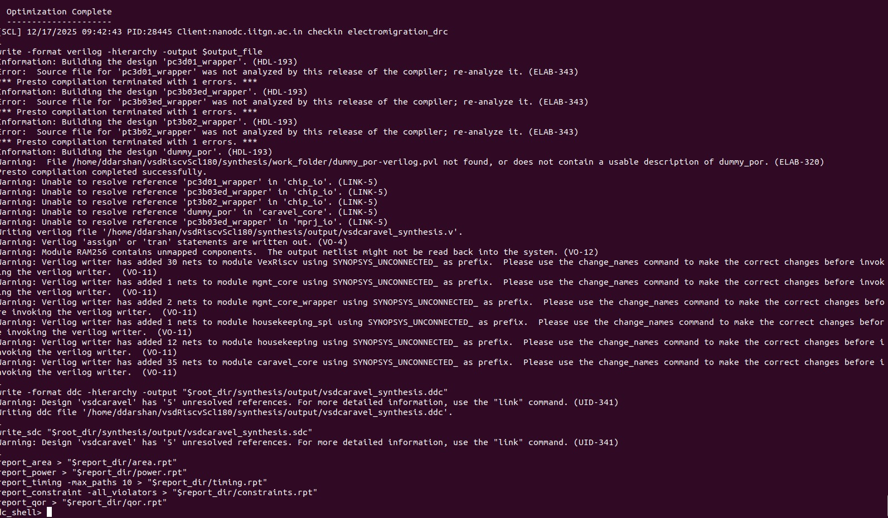
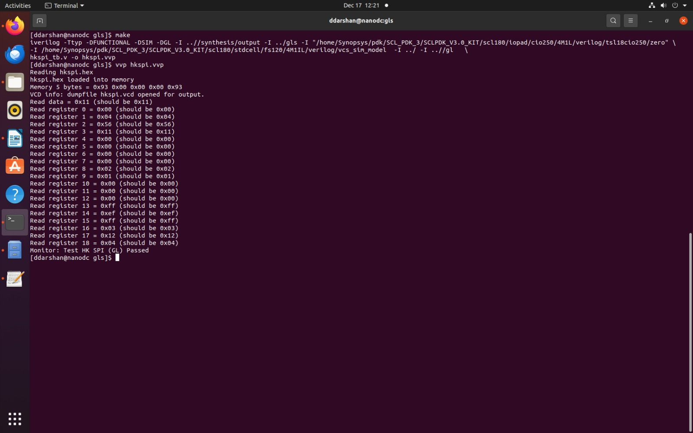
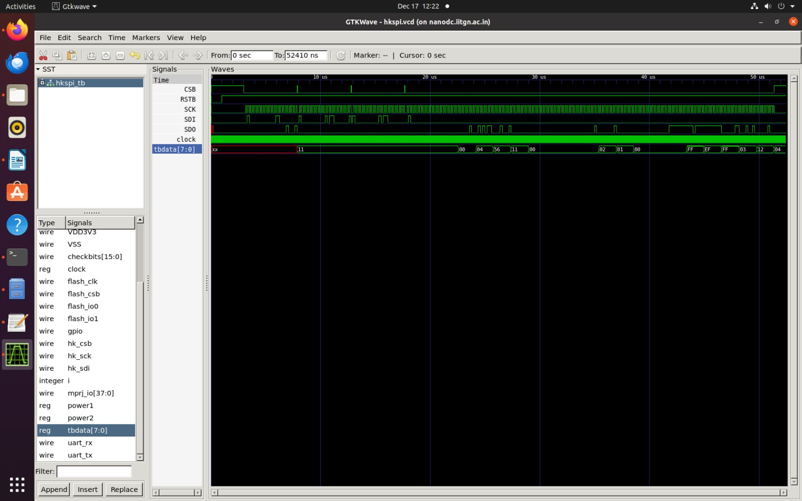
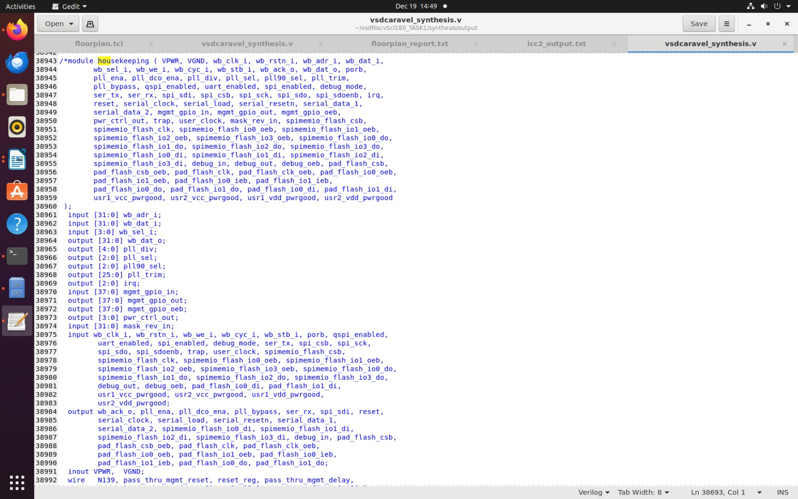
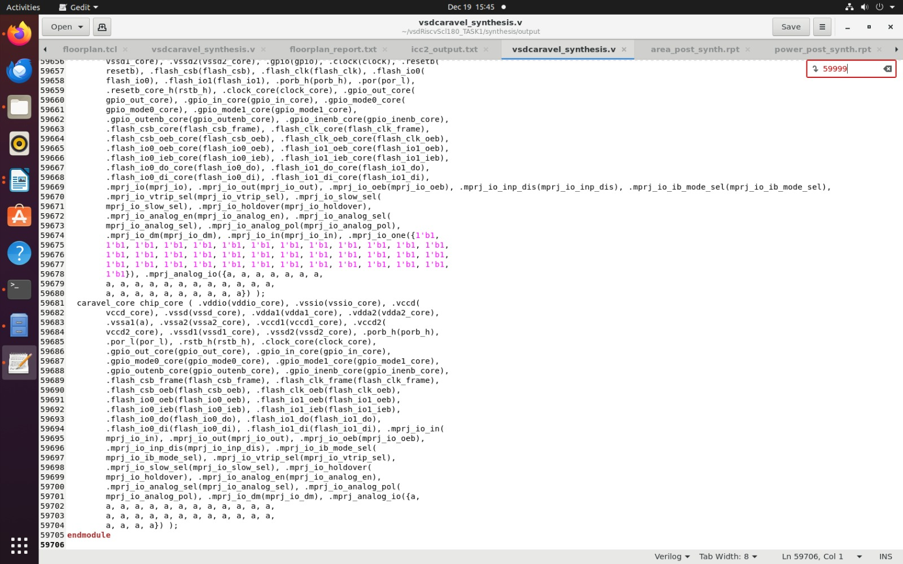

# Task 1: RISC-V Reference SoC — Functional and GLS Replication (SCL180)
<p align="center">
  &nbsp;
  &nbsp;
  &nbsp;
  &nbsp;
  
</p>

## Overview
This repository documents the **complete end-to-end replication** of the **vsdcaravel RISC-V Reference SoC** using the **SCL180 PDK**, covering both **Functional (RTL) Simulation** and **Gate-Level Simulation (GLS)** exactly as demonstrated in the official reference repository.

The objective of this task is not only to reproduce waveforms, but to **deeply understand the SoC architecture, power intent, verification methodology, and tapeout readiness requirements** for an SCL180-based RISC-V SoC.

---

## Repository Structure

```
Day1_Task_Replication/
├
├──logs  
├──.Screenshots   
├──Readme.md   
├──Reports  
│
└── 
```

---

## 1.Repository Study

A thorough study of the reference repository was carried out to understand the **structural hierarchy, verification strategy, and synthesis assumptions**.

### Folder-wise Understanding

| Folder       | Description                                                                                          |
| ------------ | ---------------------------------------------------------------------------------------------------- |
| `rtl/`       | Complete RTL of the SoC including `vsdcaravel.v`, VexRiscv core, RAM, POR, housekeeping and IO logic |
| `dv/`        | Design Verification testbenches (hkspi used for Task-1)                                              |
| `synthesis/` | Synthesis-ready configuration and constraints                                                        |
| `gl/`        | Synthesized gate-level netlists                                                                      |
| `gls/`       | Gate-level simulation setup                                                                          |
| `images/`    | Reference waveforms and expected outputs                                                             |

### Top-Level Module: `vsdcaravel.v`

`vsdcaravel.v` is the **SoC integration wrapper** responsible for:

* Power domain connectivity (1.8V & 3.3V)
* Padframe to core interfacing
* Clock and reset distribution
* Integration of the management SoC (`caravel_core`)

This module represents the **exact boundary between silicon pads and digital core logic**, making it critical for both simulation and tapeout.

### Top Module

* **Top Module:** `vsdcaravel.v`
* Integrates:

  * VexRiscv CPU
  * RAM128
  * Power-On Reset (POR)
  * Housekeeping SPI (hkspi)
  * IO pads (SCL180)
  * etc..
---

## 2. Functional (RTL) Simulation

### Objective

The goal of RTL simulation is to **functionally validate the SoC behavior** without any timing or physical effects, ensuring that:

* RTL connectivity is correct
* hkspi communication works as expected
* No X/Z propagation exists in logic paths
---
### Prerequisites

Before using this repository, ensure you have the following dependencies installed:

- SCL180 PDK ( SCL180 PDK)
- RiscV32-uknown-elf.gcc (building functional simulation files)
- Caravel User Project Framework from Efabless
- Synopsys EDA tool Suite for Synthesis
- GTKWAVE (used for visualizing testbench waves)
---
## Repository cloning Setup

- Clone the repository:
```bash
git clone https://github.com/vsdip/vsdRiscvScl180.git
cd vsdRiscvScl180
git checkout iitgn
```
- Install required dependencies (ensure dc_shell and SCL180 PDK are properly set up).
---
### Location
```bash
cd home/ddarshan/vsdRiscvScl180/dv/hkspi/
```
---
### Makefile Configuration

The following paths were updated:

- Edit Makefile at this path ./dv/hkspi/Makefile
- Modify and verify GCC_Path to point to correct riscv installation
-  Modify and verify scl_io_PATH to point to correct io

* `GCC_PATH` → Local RISC-V GCC installation
* `scl_io_PATH` → SCL180 IO behavioral models
---
### Commands Used for RTL Simualtion

- Make sure hkspi.vvp file has been deleted from the hkspi folder.
- Run following command to generate vvp file for functional simulation.

```bash
# Clean the files before running
make clean

# It will compile the rtl simulation
make

vvp hkspi.vvp
```

**Example Output**

```
Read data = 0x11 (should be 0x11)

Read register 0  = 0x00 (should be 0x00)
Read register 1  = 0x04 (should be 0x04)
Read register 2  = 0x56 (should be 0x56)
Read register 3  = 0x11 (should be 0x11)
Read register 4  = 0x00 (should be 0x00)
Read register 5  = 0x00 (should be 0x00)
Read register 6  = 0x00 (should be 0x00)
Read register 7  = 0x00 (should be 0x00)
Read register 8  = 0x02 (should be 0x02)
Read register 9  = 0x01 (should be 0x01)
Read register 10 = 0x00 (should be 0x00)
Read register 11 = 0x00 (should be 0x00)
Read register 12 = 0x00 (should be 0x00)
Read register 13 = 0xff (should be 0xff)
Read register 14 = 0xef (should be 0xef)
Read register 15 = 0xff (should be 0xff)
Read register 16 = 0x03 (should be 0x03)
Read register 17 = 0x12 (should be 0x12)
Read register 18 = 0x04 (should be 0x04)

Monitor: Test HK SPI (RTL) Passed
```


- From the terminal output :
- hkspi.hex successfully loaded into SoC memory.
✔ All housekeeping SPI registers returned expected values.
✔ No mismatches between expected and observed data.
✔ Confirms correct SPI protocol handling, register mapping, and RTL connectivity.

**📌 Conclusion:** HK-SPI Functional (RTL) Simulation `PASSED` successfully.

**Visualize the Testbench waveforms for complete design using following command**
```bash
gtkwave hkspi.vcd hkspi_tb.v
```


### Observations
The RTL waveform confirms correct housekeeping SPI operation:

* hkspi transactions decoded correctly
* Clock, reset, and SPI FSM behaved as expected
* Clean waveforms with no unknown states

The observed waveforms directly correlate with the console output, confirming successful HK-SPI functional verification at RTL level.

---
## 3.  Synthesis Flow (SCL180 – Synopsys Design Compiler)

### Objective

- The synthesis stage converts the **RTL description of the `vsdcaravel` RISC-V SoC** into a **gate-level netlist** using **SCL180 standard-cell and IO libraries**.  
- This step ensures that the design is **technology-mapped, timing-aware, power-aware, and ready for GLS and physical design**.

---
### Path Setup Overview

- A correct library and directory path setup is **mandatory** for successful synthesis.

## Synthesis tcl script

```

read_db "/home/Synopsys/pdk/SCL_PDK_3/SCLPDK_V3.0_KIT/scl180/iopad/cio250/4M1L/liberty/tsl18cio250_min.db"

read_db "/home/Synopsys/pdk/SCL_PDK_3/SCLPDK_V3.0_KIT/scl180/stdcell/fs120/4M1IL/liberty/lib_flow_ff/tsl18fs120_scl_ff.db"


set target_library "/home/Synopsys/pdk/SCL_PDK_3/SCLPDK_V3.0_KIT/scl180/iopad/cio250/4M1L/liberty/tsl18cio250_min.db /home/Synopsys/pdk/SCL_PDK_3/SCLPDK_V3.0_KIT/scl180/stdcell/fs120/4M1IL/liberty/lib_flow_ff/tsl18fs120_scl_ff.db"

set link_library {"* /home/Synopsys/pdk/SCL_PDK_3/SCLPDK_V3.0_KIT/scl180/iopad/cio250/4M1L/liberty/tsl18cio250_min.db /home/Synopsys/pdk/SCL_PDK_3/SCLPDK_V3.0_KIT/scl180/stdcell/fs120/4M1IL/liberty/lib_flow_ff/tsl18fs120_scl_ff.db"}

set_app_var target_library $target_library
set_app_var link_library $link_library


set root_dir "/home/risc_user1/work/vsdRiscvScl180"
set io_lib "/home/Synopsys/pdk/SCL_PDK_3/SCLPDK_V3.0_KIT/scl180/iopad/cio250/4M1L/verilog/tsl18cio250/zero"
set verilog_files  "$root_dir/rtl"
set top_module "vsdcaravel" ;
set output_file "$root_dir/synthesis/output/vsdcaravel_synthesis.v"
set report_dir "$root_dir/synthesis/report"
read_file $verilog_files/defines.v
read_file $io_lib -autoread -define USE_POWER_PINS -format verilog
read_file $verilog_files/scl180_wrapper -autoread -define USE_POWER_PINS -format verilog
read_file $verilog_files -autoread -define USE_POWER_PINS -format verilog -top $top_module
read_sdc "$root_dir/synthesis/vsdcaravel.sdc"
update_timing

elaborate $top_module

link
#set_uniquify_design false;
#set_flatten false

compile
report_qor > "$report_dir/qor_post_synth.rpt"
report_area > "$report_dir/area_post_synth.rpt"
report_power > "$report_dir/power_post_synth.rpt"

write -format verilog -hierarchy -output $output_file
```

**Root Directory Path**

```tcl
set root_dir "/home/ddarshan/vsdRiscvScl180"
```
- Contains:

    - RTL sources
    - Synthesis scripts
    - Constraint files
    - Output and report directories

**SCL PDK Library Paths**

1. IO Pad Library (3.3V)

```bash
read_db "/home/Synopsys/pdk/SCL_PDK_3/SCLPDK_V3.0_KIT/scl180/iopad/cio250/4M1L/liberty/tsl18cio250_min.db"
```
**Used for:**

- Padframe cells
- GPIO, SPI, and external interfaces

2. Standard Cell Library (1.8V Core)
```bash
read_db "/home/Synopsys/pdk/SCL_PDK_3/SCLPDK_V3.0_KIT/scl180/stdcell/fs120/4M1IL/liberty/lib_flow_ff/tsl18fs120_scl_ff.db"
```

**Used for:**

- Core logic
- Flip-flops, combinational cells
- Timing and power analysis

**Target and Link Libraries**
```bash
set target_library "...cio250_min.db ...tsl18fs120_scl_ff.db"
set link_library {"* ...cio250_min.db ...tsl18fs120_scl_ff.db"}
```

- Why this matters: 

    - target_library → cells used for synthesis
    - link_library → resolves references during elaboration
    - Ensures no unresolved cells during compile

**SCL IO Verilog Models Path**
```bash
set io_lib "/home/Synopsys/pdk/SCL_PDK_3/SCLPDK_V3.0_KIT/scl180/iopad/cio250/4M1L/verilog/tsl18cio250/zero"
```

**Used to:**

- Instantiate IO pad behavioral models
- Support power-aware synthesis (USE_POWER_PINS)

**RTL and Constraint Setup**

- RTL Files
```bash
set verilog_files "$root_dir/rtl"
set top_module "vsdcaravel"
```

- Includes:

    - vsdcaravel.v (top module)
    - caravel_core
    - Housekeeping, RAM, POR, pad wrappers

**Power-Aware RTL Reading**
```bash
read_file $io_lib -autoread -define USE_POWER_PINS -format verilog
read_file $verilog_files -autoread -define USE_POWER_PINS -format verilog -top $top_module
```

**✔ Ensures:**

- Explicit power pin connectivity (vdd, vss)
- Correct mapping to SCL180 libraries

**Timing Constraints**

- read_sdc "$root_dir/synthesis/vsdcaravel.sdc"
- update_timing

**Used to:**

- Define clock constraints
- Enable timing-driven synthesis

**⚙️ Synthesis Execution**
```bash

# Design Elaboration and Linking
elaborate vsdcaravel

link
```
- Resolves hierarchy
- Binds RTL to standard cells and IO pads

**To Compile**
```bash
compile
```
- Performs:

    - Logic optimization
    - Technology mapping
    - Timing optimization

**📊 Post-Synthesis Reports**
```bash
report_qor   > qor_post_synth.rpt
report_area > area_post_synth.rpt
report_power > power_post_synth.rpt
```

- These reports provide:

    - Quality of Results (QoR)
    - Cell area utilization
    - Estimated dynamic and leakage power

**🧾 Netlist Generation**
```bash
write -format verilog -hierarchy -output vsdcaravel_synthesis.v
```

✔ Generated netlist is used for:

- Gate-Level Simulation (GLS)
- Physical design (PnR)
- Timing sign-off

**▶️ Running Synthesis**

-Go location
```bash
cd synthesis/work_folder
```

-To do synthesis in synopsys using `dc_shell`, run
```bash
dc_shell -f ../synth.tcl
```

- Before running:

    - Verify all library paths in synth.tcl
    - Ensure SCL180 PDK is accessible
    - Confirm vsdcaravel.sdc exists

**Terminal Screenshot**



**✅ Outcome**

- Synthesis completed successfully using SCL180 libraries
- No unresolved references or missing cells
- Netlist validated through Gate-Level Simulation
- Design is ready for physical implementation


**This synthesis flow closely mirrors an industry-grade tapeout preparation using foundry-provided PDKs and Design Compiler.**

---
## 4. Gate-Level Simulation (GLS)

### Objective

Gate-Level Simulation validates that the **synthesized netlist preserves RTL functionality**, ensuring:

* No synthesis-induced logical mismatches
* Correct handling of power pins
* Compatibility with SCL180 standard cell models

### Location

```bash
gls/
```
--- 

### GLS Execution

```bash
make clean
make
vvp hkspi.vvp
```

**Example Output**

```
Read data = 0x11 (should be 0x11)

Read register 0  = 0x00 (should be 0x00)
Read register 1  = 0x04 (should be 0x04)
Read register 2  = 0x56 (should be 0x56)
Read register 3  = 0x11 (should be 0x11)
Read register 4  = 0x00 (should be 0x00)
Read register 5  = 0x00 (should be 0x00)
Read register 6  = 0x00 (should be 0x00)
Read register 7  = 0x00 (should be 0x00)
Read register 8  = 0x02 (should be 0x02)
Read register 9  = 0x01 (should be 0x01)
Read register 10 = 0x00 (should be 0x00)
Read register 11 = 0x00 (should be 0x00)
Read register 12 = 0x00 (should be 0x00)
Read register 13 = 0xff (should be 0xff)
Read register 14 = 0xef (should be 0xef)
Read register 15 = 0xff (should be 0xff)
Read register 16 = 0x03 (should be 0x03)
Read register 17 = 0x12 (should be 0x12)
Read register 18 = 0x04 (should be 0x04)

Monitor: Test HK SPI (GL) Passed
```




**📌 Conclusion:** HK-SPI Functional (GL) Simulation `PASSED` successfully.

**Visualize the Testbench waveforms for complete design using following command**

```bash
gtkwave hkspi.vcd hkspi_tb.v
```


### Observations

* GLS waveform matches RTL waveform
* No X-propagation on SPI or reset paths
* hkspi FSM transitions preserved post-synthesis

---

### RAM128 Module Explanation

The `RAM128` module represents a **128 x 32-bit single-port SRAM macro** used by the management SoC.

Key points:

* Declared as a **black box** during synthesis
* Behavioral model is excluded to mimic real silicon memory
* Explicit power pins (`VPWR`, `VGND`) are included for physical accuracy

This approach mirrors real tapeout flows where SRAM is replaced by a foundry macro.

### Black-Box Resolution

- The following black-box modules were resolved manually by removing these verilog files :

* `dummy_por`
* `RAM128`
* `housekeeping`

- and added at the top of the synthesized netlist:

```verilog
`include "dummy_por.v"
`include "RAM128.v"
`include "housekeeping.v"
```

**Black boxed RAM128.v**


**Black boxed Dummy_por.v**


**Black boxed Housekeeping.v**




### Power Pin Correction

In `vsdcaravel.v`:

* Constant `1'b0` connections were replaced with `a`
* Ensures correct analog ground referencing in GLS



---

## 5. Issues Faced & Resolutions

| Issue                   | Resolution                           |
| ----------------------- | ------------------------------------ |
| Black-box errors in GLS | Manually included RTL models         |
| Power pin mismatch      | Replaced constant ground with `a` |
| Missing IO models       | Corrected SCL IO path in Makefile    |

---

## Conclusion

This task successfully demonstrates a **complete SoC bring-up workflow** for the vsdcaravel RISC-V SoC using the **SCL180 PDK**, covering:

* RTL functional verification
* Gate-level verification with power-aware fixes
* Black-box handling consistent with real tapeout flows

The results confirm that the design is **functionally stable, synthesis-consistent, and ready for further physical design stages**.

---
## System Details

* **Machine:** IIT Gandhinagar Linux Machine
* **Simulator:** Icarus Verilog
* **PDK:** SCL180
---
## Acknowledgement

I sincerely thank **Kunal Ghosh Sir**, **IIT Gandhinagar**, and the **VSD Team** for providing the opportunity and technical framework to work on an industry-grade RISC-V SoC using the SCL180 open PDK.

---

> **Reference Repository:**
> [https://github.com/vsdip/vsdRiscvScl180/tree/iitgn](https://github.com/vsdip/vsdRiscvScl180/tree/iitgn)
