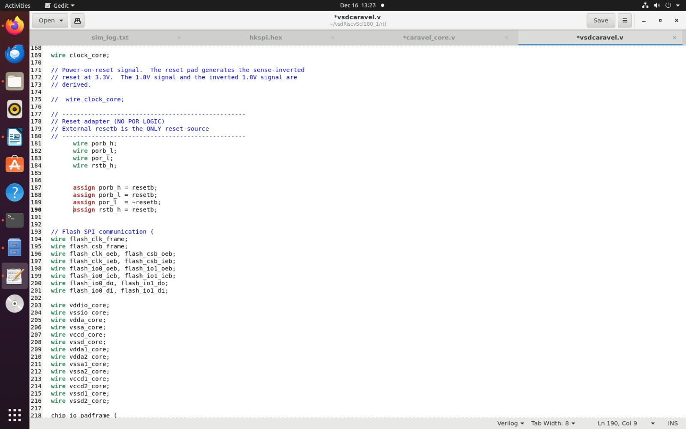
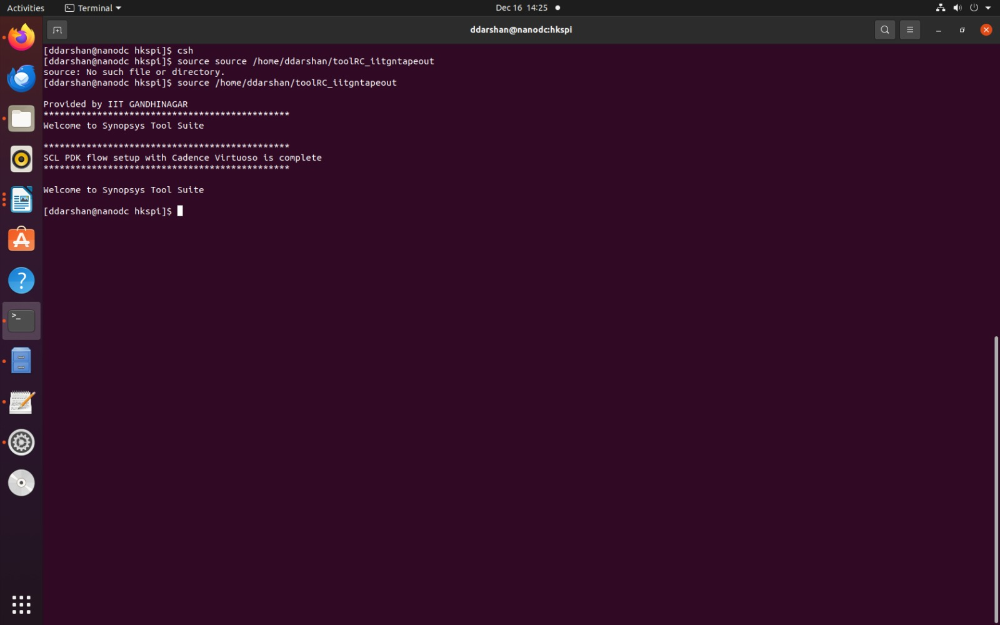
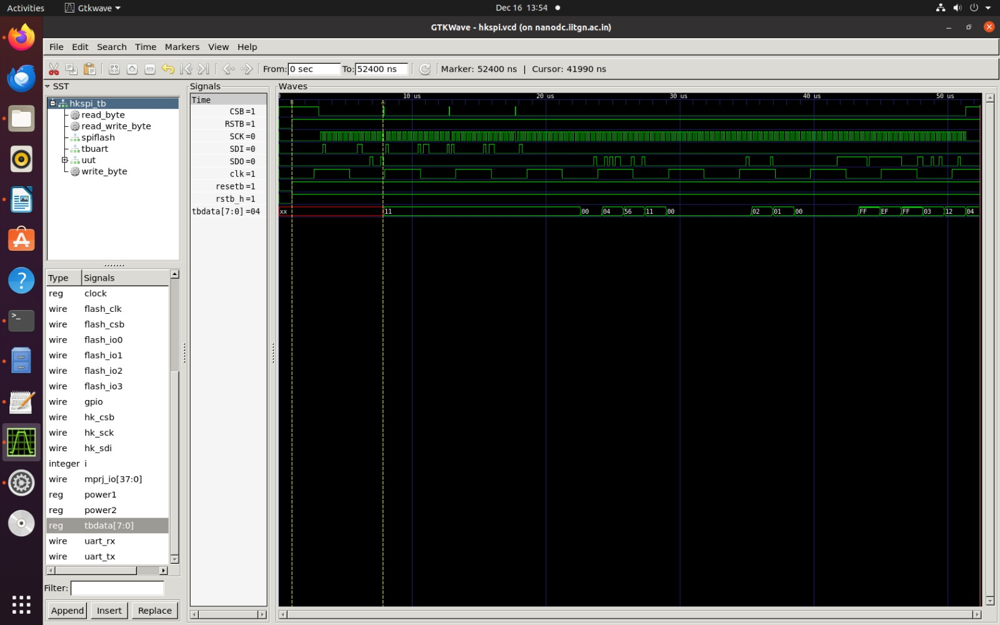
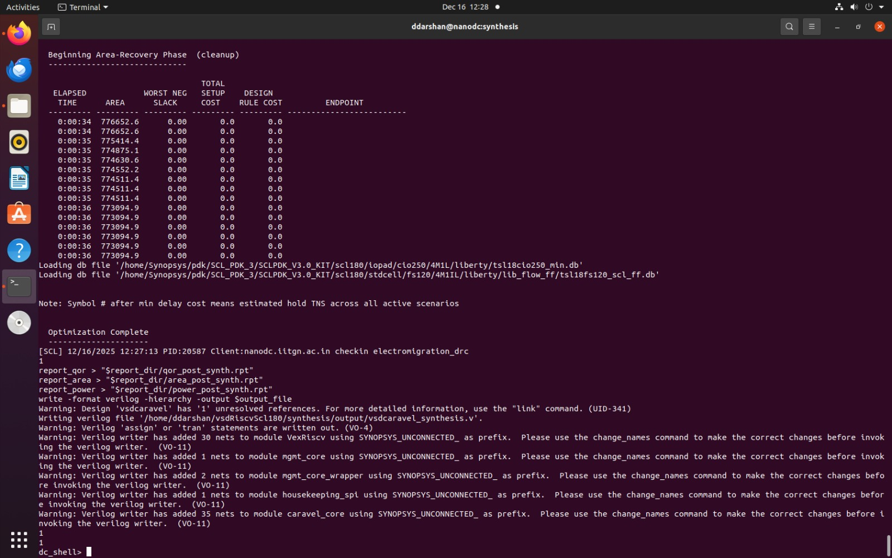
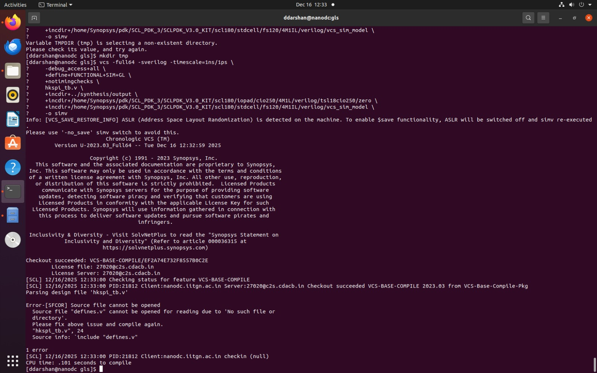
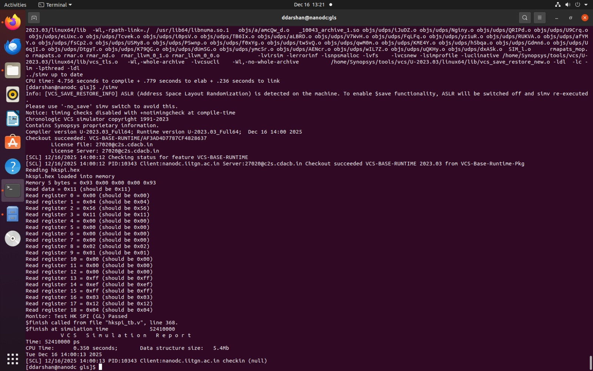

# 🚀 Task3 - Removal of On-Chip POR and Final GLS Validation (SCL-180)

<div align="center">


</div>

## Objective
- The objective of this task is to remove the on-chip Power-On Reset (POR) logic from the VSD Caravel–based RISC-V SoC and demonstrate that a design relying only on a single external active-low reset pin is safe and correct for the SCL-180 technology.
- This work aims to show, through RTL analysis, pad-level reasoning, synthesis, and gate-level simulation, that:
  - No internal POR circuitry is required.
  - All reset behavior is explicit and externally controlled.
  - The resulting design remains functionally correct and synthesizable.
  
**Technology Note**

- This design targets the SCL-180 standard-cell and I/O library.
- As a result, SKY130-specific POR assumptions and pad behavior are removed.
- All reset decisions and documentation are written from an SCL-180 perspective.

---
## 🧠 Context & Motivation (Why This Task Exists)

- Earlier flows used a behavioral dummy_por to emulate reset sequencing. However:
- Digital PORs written in RTL are not synthesizable
- Real PORs are analog macros, not digital logic
- In SCL-180, reset pads are available immediately after power-up
- Board-level reset supervision is architecturally correct
- This task validates—rigorously and formally—that an external reset pin is sufficient, and that no internal POR logic is required
---
## Phase-1: Study of Existing POR Usage

👉 **The complete analysis for this phase is documented here:**  
📄 **[POR_Usage_Analysis.md](https://github.com/DivyaDarshan09/Divya_Darshan-VSD-IITGN-RISCV-Tapeout-Program/blob/main/3-Task_No_POR_Final_GLS/POR_Usage_Analysis.md)**

This document covers:
- Identification and role of `dummy_por`
- Usage of `porb_h`, `porb_l`, and `por_l`
- Reset distribution paths across the SoC
- Clear separation between POR-driven logic and generic reset logic

This README continues from that analysis and documents **Phase-2 (RTL Refactoring)**, **Phase-3 (DC_TOPO Synthesis)**, and **Phase-4 (Final GLS)**.


## Phase 1.1 :Pad-Level Reset Analysis (Critical Thinking)

👉 **Detailed analysis:**
📄 **[PAD_Reset_Analysis.md](Pad_Reset_Analysis.md)**

**Key Findings (SCL-180 Perspective)**

- Reset pads do not require internal POR gating
- Reset pin is asynchronous and usable immediately after VDD
- No documented requirement for internal POR sequencing
- Board-level reset handling is expected

---
## Phase-2: RTL Refactoring (POR Removal)

### Goal

Completely eliminate POR logic from the RTL and introduce a **single explicit external reset pin**.

### Changes Performed

#### Removed
- `dummy_por` module
- All POR-generated timing/delay behavior
- Any reset logic dependent on power-edge detection

#### Introduced

```bash
input reset_n;   // Active-low external reset (Global Reset Pin)

# Explicit Reset Mapping (Legacy Compatibility)

assign porb_h = reset_n;
assign porb_l = reset_n;
assign por_l  = ~reset_n;
assign rstb_h = reset_n;
```
- These assignments are pure aliases — no logic, no delay, no inference.

**Screenshot:** `POR` Removed Logic ✅




---
**Design Rules Enforced**

- ❌ No digital POR
- ❌ No counters
- ❌ No power-pin edge detection
- ✅ Reset behavior fully explicit and visible
- ✅ All sequential logic resets from `reset_n`

**⚠️ Reset Assumptions & Risk Analysis**
**Assumptions**
- External reset asserted during power-up
- Reset de-asserted only after VDD stabilization
- Reset driven by board-level supervisor / RC network

 **Risks Considered & Mitigation**

| Risk                | Mitigation                   |
| ------------------- | ---------------------------- |
| Early reset release | Board-level reset supervisor |
| Power-up X-states   | Reset held low during ramp   |
| Absence of POR      | Analog handled outside SoC   |


**Concludion**

- All risks are system-level, not digital-logic problems.
- They do not justify an RTL-based POR.

---
### RTL SIMULATION

- Navigate to the HK-SPI test directory:
```bash
cd dv/hkspi/
```
- The Synopsys environment is initialized before invoking VCS.
```bash
csh
source /home/ddarshan/toolRC_iitgntapeout
```
**Screenshot: Synopsys environment**




- The following command compiles the RTL and testbench and creates the simulation executable.
  
```bash
vcs -full64 -sverilog -timescale=1ns/1ps -debug_access+all \
    +incdir+../ +incdir+../../rtl +incdir+../../rtl/scl180_wrapper \
    +incdir+/home/Synopsys/pdk/SCL_PDK_3/SCLPDK_V3.0_KIT/scl180/iopad/cio250/6M1L/verilog/tsl18cio250/zero \
    +define+FUNCTIONAL +define+SIM \
    hkspi_tb.v -o simv
```
- The simulation is executed and a VCD file is generated for waveform viewing.
```bash
./simv -no_save +define+DUMP_VCD=1 | tee sim_log.txt
```

**Screenshot:** RTL Terminal Log


- All test cases pass successfully. The values read from registers 0 to 18 match the expected results, confirming correct functional behavior of the design.

**Waveforms are viewed using GTKWave.**
```bash
gtkwave hkspi.vcd hkspi_tb.v
```
**Screenshot:** RTL Waveform



**Verifying the reset behaviour**


- As expected , the `Reset` has released at `1000ns`.

---

## 🏭 Phase-3: DC_SHELL Synthesis (POR-Free)

### Synthesis Setup

- **Tool:** Synopsys DC_TOPO
- **PDK:** SCL-180
- **Reset:** External reset_n
- No POR blackboxes
---
### How to do Synthesis

1. Navigate to the `work_folder` directory:

```bash
   cd synthesis/work_folder
```

2. Execute the synthesis script using `DC_SHELL`:

```bash
dc_shell -f synth.tcl
```

👉 **Refer Here for Synthesis TCL Script:**
📄 **[Synthesis TCL script](Synthesis.tcl.md)**


**Screenshot of Synthesis terminal log**




**🔍 Evidence: Absence of On-Chip POR (dummy_por)**

- The synthesized design was carefully inspected to confirm the complete removal of any on-chip Power-On Reset (POR) logic, including the previously used behavioral dummy_por module.

**Key Observations**

- The synthesized netlist contains no instances of:
  - dummy_por
  - POR-related counters or delay logic
  - Power-edge–dependent reset generation
- All reset behavior in the design originates exclusively from the external active-low reset pin (reset_n).
- Reset signal propagation is explicit and purely combinational, with no inferred or hidden logic.

**Synthesis Evidence**

- The screenshot below shows the synthesis netlist, clearly indicating that no `dummy_por` or equivalent `POR module` is present in the final synthesized design.


- This evidence confirms that the SoC is fully POR-free at the synthesis level.
- All sequential elements rely solely on an externally driven reset, validating that:
  - No behavioral or digital POR remains in the RTL
  - The design is cleanly synthesizable using SCL-180 standard cells
  - Reset control is explicit, deterministic, and architecturally sound

**This conclusively proves that POR removal is not only conceptual but also enforced in the final synthesized netlist.**

### 📊 Design Statistics

| Metric | Value |
|------|------:|
| Number of ports | 12,749 |
| Number of nets | 37,554 |
| Number of cells | 30,961 |
| Combinational cells | 18,422 |
| Sequential cells | 6,882 |
| Buffer / Inverter cells | 3,532 |
| Macros / Black boxes | 16 |
| Unique cell references | 2 |

---

### 📐 Area Breakdown (µm²)

| Area Component | Area |
|--------------|------:|
| Combinational logic | 341,951.96 |
| Buffer / Inverter | 28,798.12 |
| Sequential logic | 431,036.40 |
| Macro / Black boxes | 100.32 |
| Net interconnect | 32,791.10 |
| **Total cell area** | **773,088.68** |
| **Total design area** | **805,879.78** |

### 🔍 Reset-Related Observations

- ✔ No `dummy_por` instances present in the synthesized netlist  
- ✔ No POR-derived reset logic inferred  
- ✔ All **6,882 sequential elements** reset explicitly via external `reset_n`  
- ✔ No floating reset pins or constant-driven resets  
- ✔ No latch inference caused by POR removal  

---

### 🧠 Engineering Interpretation

- The sequential-to-combinational ratio indicates correct reset inference
  across the design.
- The presence of only **16 macros / black boxes** confirms that no hidden
  POR or reset IP was introduced.
- Buffer/inverter usage is consistent with clock and reset distribution
  and does **not** indicate reset gating.
- The area profile confirms that POR removal did **not** introduce
  redundancy or inefficiency.

**Outcome**

DC_SHELL successfully synthesized the POR-free SoC, proving that the design is clean, synthesizable, and reset-safe.

---

## 🧪 Phase-4: Final Gate-Level Simulation (GLS)

### GLS Configuration

- **Simulator:** Synopsys VCS
- **Netlist:** DC_TOPO output
- **Libraries:** SCL-180 functional models
- **Reset:** Testbench-driven reset_n

**Observations**

- Clean reset assertion/de-assertion
- No X-propagation after reset release
- Functional equivalence with RTL

**GLS Screenshot**





- GLS confirms that external reset-only architecture works correctly at gate level.

---
## Summary

This task demonstrates that a POR-free, externally reset SoC is architecturally correct, synthesizable, and verifiable in SCL-180, aligning with real-world ASIC design practices.

---

<p align="center">
🚀 <strong>No POR was removed blindly — it was removed deliberately, defensibly, and correctly.</strong> 🚀
</p>


