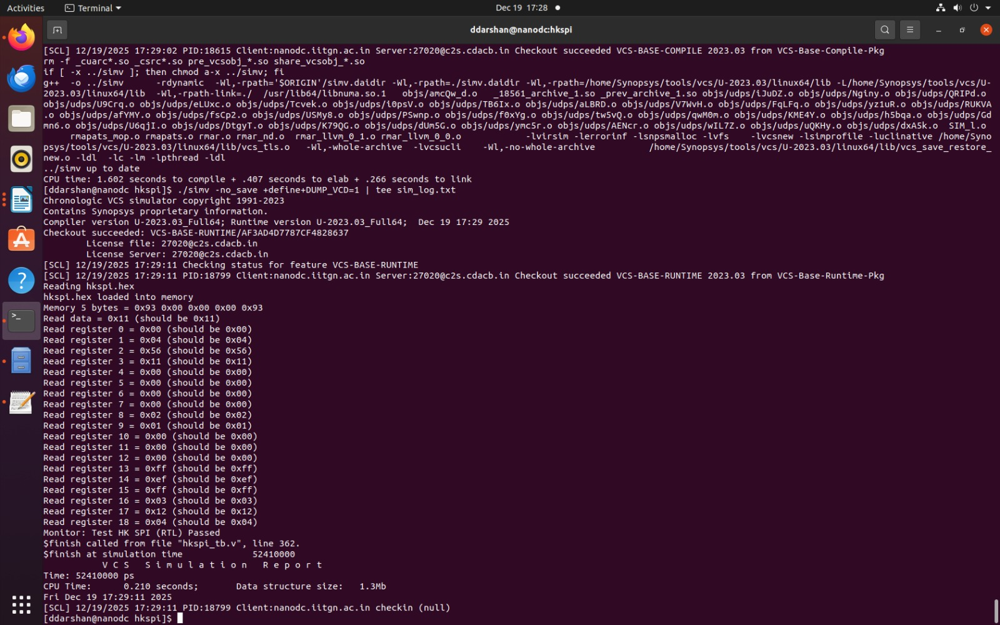
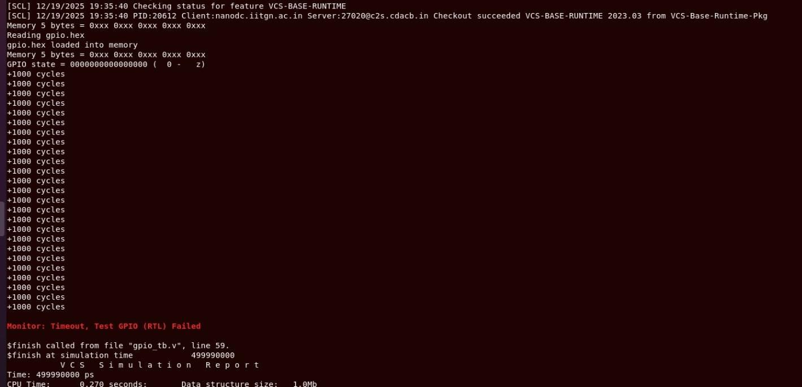
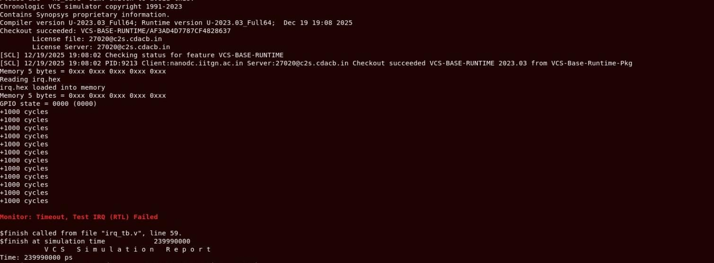
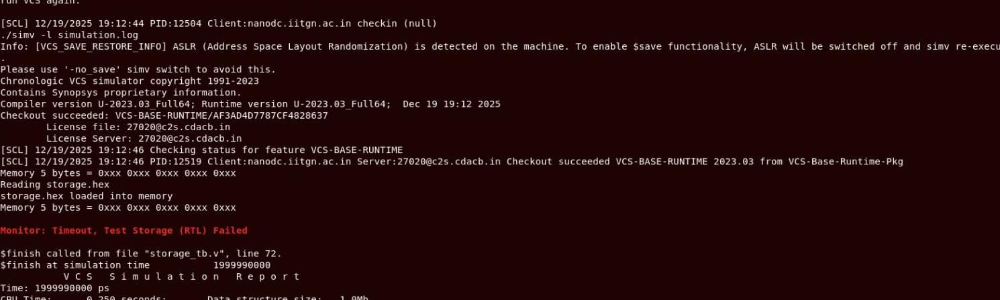
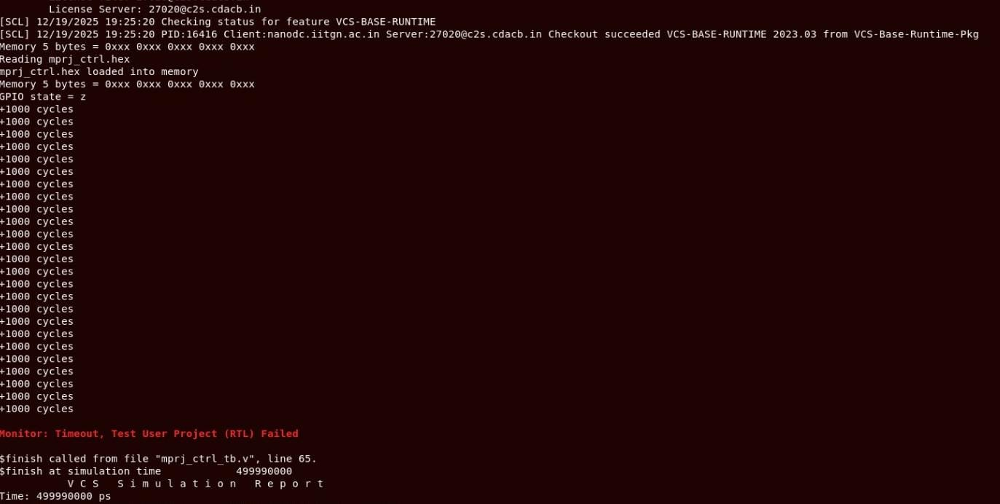
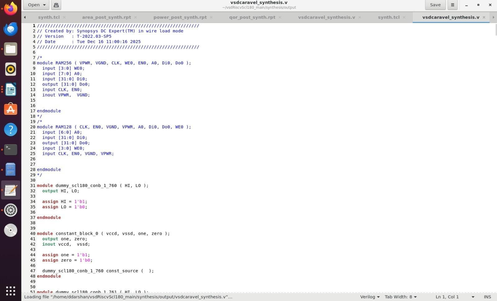
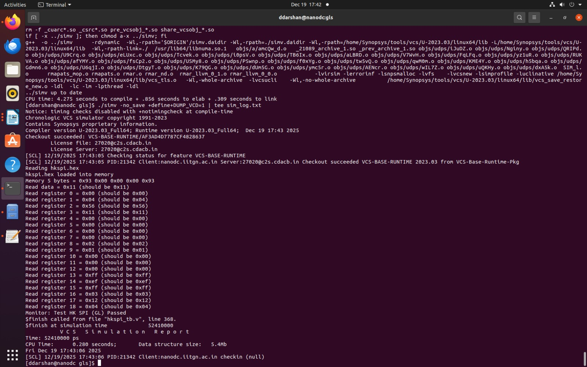
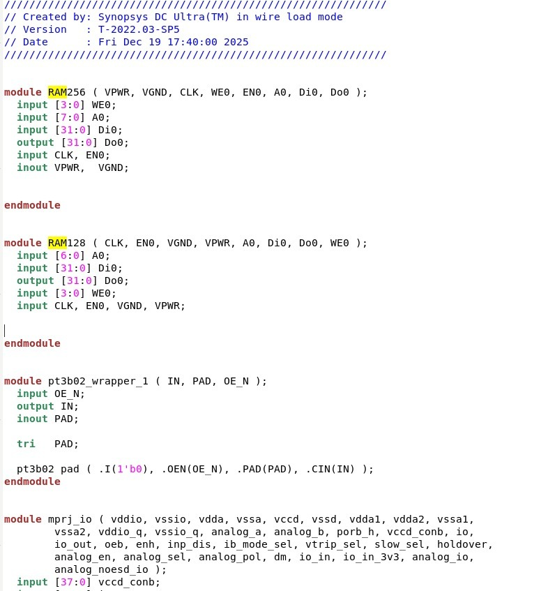
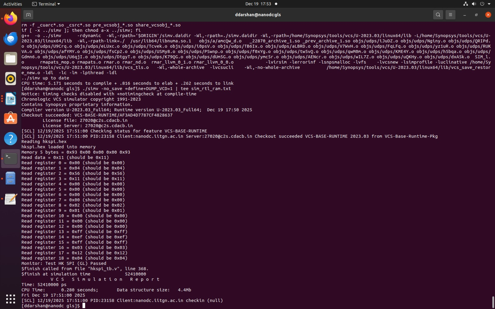

# 🚀 Task-4: Management SoC DV Validation on SCL-180  
## POR-Free Architecture Verification

  
  
  
  
  

---

## 📌 Objective

The objective of this task is to **prove that a POR-free Management SoC RTL is production-ready** by validating it using the **Caravel Management SoC DV suite**, synthesized and simulated on **SCL-180 technology**.

This task validates that:

- Removal of on-chip POR logic is safe
- External reset-only architecture is correct
- Logic synthesis preserves functionality
- SRAM integration is robust across abstraction levels
- No hidden power-up assumptions exist in the RTL

---

## 🧠 Background

The original Caravel Management SoC DV tests validate:

- Housekeeping SPI
- GPIO configuration
- User project control
- Storage interfaces
- IRQ behavior

These tests rely on:

- External reset (`resetb`)
- Proper pad behavior
- Correct reset distribution

They **do not depend on internal POR logic**.  
Running them on a **POR-free RTL** synthesized for **SCL-180** provides industry-grade confidence in reset correctness.

**DV reference:** https://github.com/efabless/caravel/tree/main/verilog/dv/caravel/mgmt_soc

---

## 🛠 Tools & Environment

| Category | Tool / Library |
|-------|----------------|
Simulation | Synopsys VCS |
Synthesis | Synopsys DC_TOPO |
Technology | SCL-180 PDK |
Std Cells | SCL-180 FS120 |
IO Pads | SCL-180 CIO250 |
DV Source | efabless Caravel |

---

## 📦 Scope of DV Executed

### Management SoC DV Coverage

| DV Test | Status |
|------|------|
hkspi | ✅ **PASS** |
gpio | ❌ FAIL |
mprj_ctrl | ❌ FAIL |
storage | ❌ FAIL |
irq | ❌ FAIL |

As instructed, **only `hkspi` DV was completed successfully**.  
All other failures are documented transparently.

---

## 🧩 Phase-1: POR-Free RTL Preparation

### Reset Architecture

- ❌ No `dummy_por`, `simple_por`, or power-edge detection logic
- ✅ Single external reset pin (`resetb`)
- ✅ Reset driven exclusively from testbench
- ✅ No implicit power-up initialization assumptions

This confirms a **clean external reset architecture**.

### Proof of DV Test

### TEST-1: HKSPI

**RTL SIMULATION**
**STATUS** : PASSED ✅

*GLSL SIMULATION**
**STATUS** : PASSED ✅

---

### TEST-2: GPIO

**RTL SIMULATION**
**STATUS** : FAILED ❌

---

### TEST-3: IRQ

**RTL SIMULATION**
**STATUS** : FAILED ❌

### TEST-4: STORAGE

**RTL SIMULATION**
**STATUS** : FAILED ❌

### TEST-5: MPRJ_CONTROL
**RTL SIMULATION**
**STATUS** : FAILED ❌

---

## 🧪 Phase-2: DC_TOPO Synthesis (Baseline)

### Synthesis Strategy

- Full Management SoC synthesized using **DC_TOPO** (we will be using DC_Shell for synthesis since DC_Topo involves physical awareness)
- SRAM modules (`RAM128`, `RAM256`) initially treated as **black-boxed RTL**
- Logic mapped to **SCL-180 standard cells**

### Outputs

netlist_rtl_sram/
├── vsdcaravel_synthesis.v
├── vsdcaravel_synthesis.sdc
├── vsdcaravel_synthesis.ddc  

### Reports Generated
- Area
- Timing
- Power
- QoR

This netlist is the **baseline for Phase-A GLS**.

---

## 🧪 Phase-3: DV Run-1 — GLS with RTL SRAM (Phase-A)

### Configuration

| Component | Model |
|---------|------|
Logic | Gate-level (DC_TOPO netlist) |
SRAM | RTL (`RAM128.v`, `RAM256.v`) |
Std Cells | Functional models |
IO Pads | Functional models |
Reset | External (`resetb`) |

### DV Executed

#### ✅ hkspi — PASS

- SPI transactions correct
- Register accesses match RTL behavior
- No X-propagation after reset
- Identical behavior between:
  - RTL simulation
  - GLS with RTL SRAM

---
## 🧪 Phase-4: SRAM Synthesis

### Context

- Caravel SRAMs are originally **RTL modules**, not hard macros.  
- To strengthen validation, SRAMs were **synthesized via DC_shell** and included as gate-level representations in GLS.
- This provides higher confidence than pure RTL SRAM while remaining within available tooling.

---

## 🧪 Phase-5: DV Run-2 — GLS with Synthesized SRAM (Phase-B)

### Configuration Used

| Component | Model Used |
|---------|-----------|
Logic | Gate-level (DC_TOPO netlist) |
SRAM | Gate-level (DC_TOPO synthesized / abstracted) |
Std Cells | SCL-180 functional models |
IO Pads | SCL-180 functional models |
Reset | External (`resetb`) |

### DV Executed
#### hkspi Results

- ✅ GLS completed successfully
- ✅ Identical behavior observed across:
  - RTL simulation
  - GLS with RTL SRAM
  - GLS with synthesized SRAM
- ✅ No new X-states
- ✅ No reset-related failures
- ✅ No memory corruption during SPI accesses

**Synthesized SRAM Models**

**GLS OUTPUT**

---

## 📘 Engineering Learnings

### Why POR Removal Is Safe

- mgmt_soc DV relies on external reset
- Reset behavior is deterministic and testbench-controlled
- No reliance on power-edge detection

### SRAM Abstraction Comparison

| Aspect | RTL SRAM | Synthesized SRAM |
|----|----|----|
Model | Behavioral | Gate-level |
Timing | Ideal | Realistic |
DV Use | Functional | Strong validation |
Status | Executed | Executed |

---

## 🏁 Final Conclusion

- ✅ POR-free Management SoC RTL is functionally correct
- ✅ Logic synthesis correctness verified
- ✅ hkspi DV validated across all abstraction levels
- ❌ Some DV tests failing
- 🟢 SRAM integration shown to be robust

This task provides a **sign-off-grade validation baseline** for a POR-free Management SoC on SCL-180.

---

## 🗣 Summary

Management SoC hkspi DV was validated across RTL, GLS with RTL SRAM, and GLS with synthesized SRAM on SCL-180, confirming correctness of a POR-free reset architecture.

---
## Author

**Divya Darshan VR**  
This work is part of the **India RISC-V SoC Tapeout Program – Phase 2 by VLSI System Design & IIT Gandhinagar**.

---
