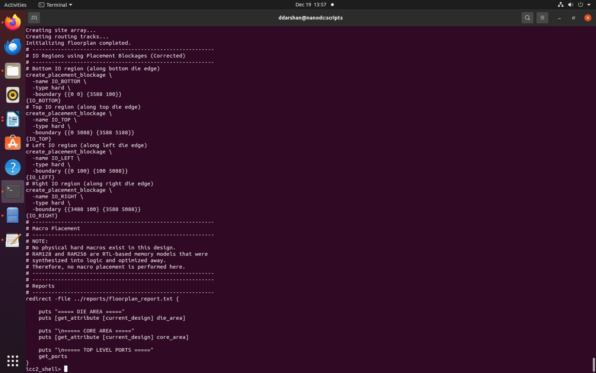
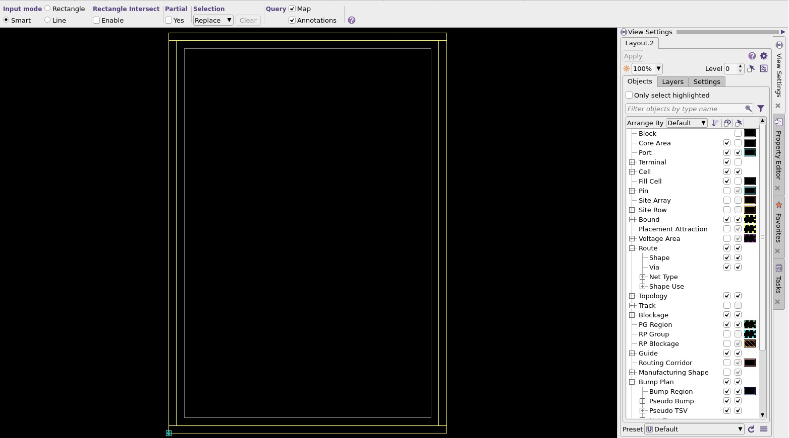
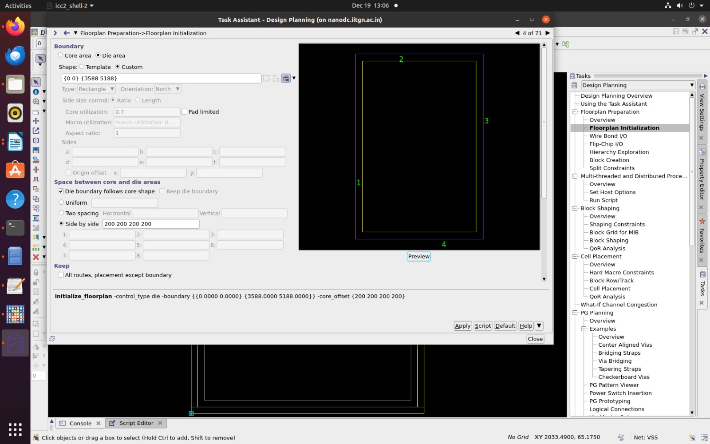
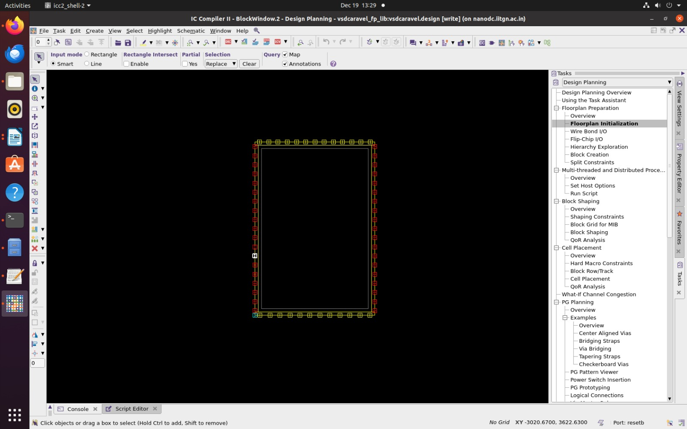
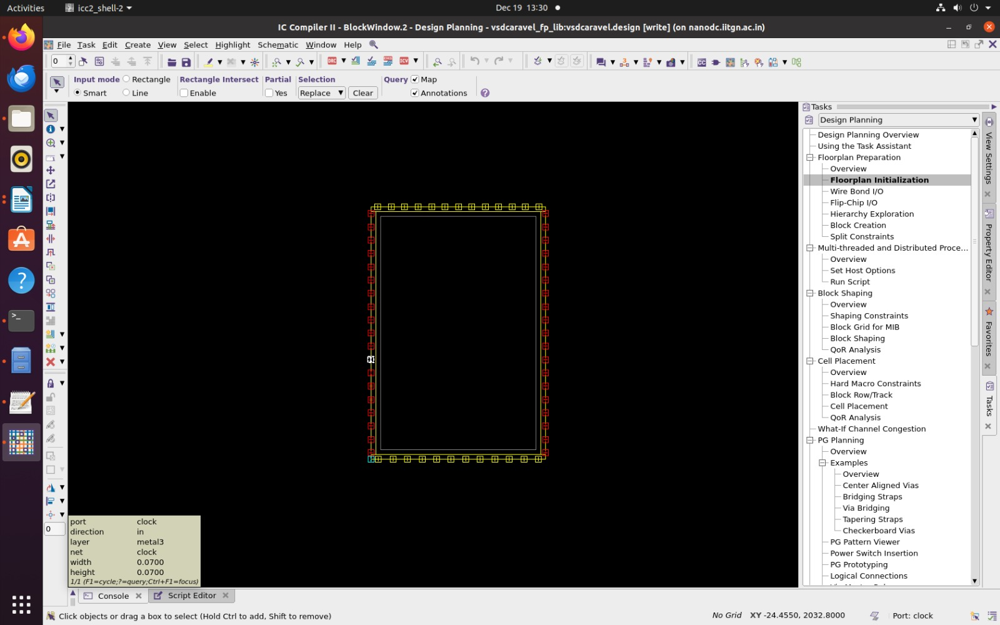
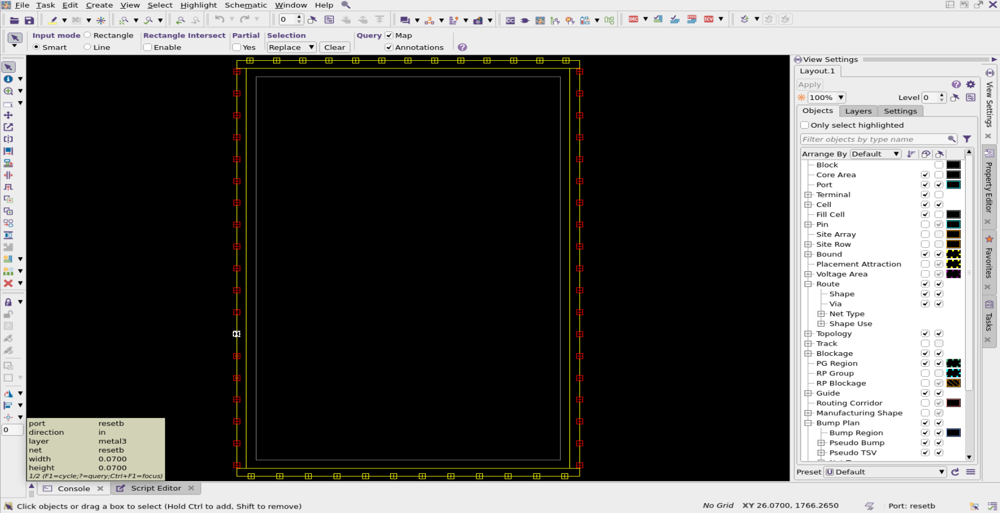
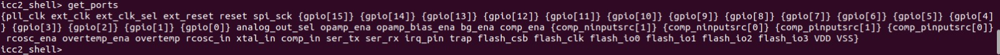
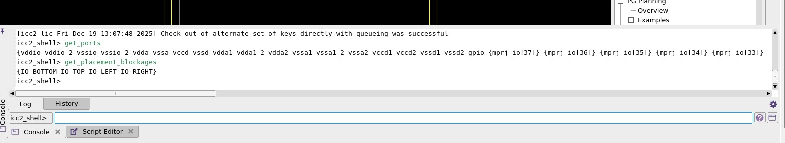
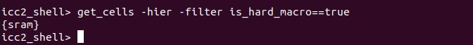

# 🚀 Task 5: SoC Floorplanning Using ICC2 (Floorplan Only)

<p align="center">
  
  
  
  
  
</p>


## 1. Objective

The objective of this task is to create a **correct and clean SoC-level floorplan** using **Synopsys IC Compiler II (ICC2)**.  
This task focuses on **physical planning fundamentals** rather than implementation details.

Specifically, the goals are to:
- Define an **exact die size**
- Create a **core region with proper margins**
- Ensure **IO accessibility around all four sides**
- Gain hands-on understanding of **ICC2 floorplanning concepts and commands**

This task intentionally stops at the **floorplanning stage** to reinforce correct design abstraction and hierarchy.

---

## 2. Tools Used

- **Tool**: Synopsys IC Compiler II (ICC2)
- **Technology**: Nangate45nm
- **Input**: Synthesized gate-level netlist of `Raven_Wrapper`
- **Output**: Floorplan database, reports, and screenshots

## 3. About ICC2 Tool

### Tool Used: IC Compiler II (ICC2)

IC Compiler II (ICC2) is a physical design tool from Synopsys used in the back-end VLSI design flow. It transforms a synthesized netlist into a manufacturable layout by performing floorplanning, placement, clock tree synthesis, routing, and physical optimization. In this work, ICC2 is used specifically for floorplanning, where the core area, macro placement, power planning, and routing resources are defined.

For more details, refer here 👉 [ICC2 Datasheet](https://www.synopsys.com/content/dam/synopsys/implementation&signoff/datasheets/ic-compiler-ii-ds.pdf)

---

## 4. Scope of This Task (Very Important)

### Included
- Die boundary definition
- Core area definition
- IO planning at a conceptual level
- Floorplan visualization
- Reporting and documentation

### Explicitly Excluded
- Standard-cell placement
- Macro placement optimization
- Clock Tree Synthesis (CTS)
- Routing
- Power Delivery Network (PDN)
- Timing closure

**Reason**: Floorplanning is a **planning and architectural stage**, not an optimization or implementation stage.

---

## 5. Design Overview

- **Design Name**: `Raven_Wrapper`
- **Design Type**: Top-level SoC wrapper
- **Hierarchy Level**: Chip top
- **Purpose**: Integration wrapper for Raven-based system
- **Internal Blocks**:
  - Raven CPU core
  - Peripheral logic
  - Control and interface logic

---

## 6. Technology and Libraries

### Reference Library

A pre-built **NDM (Next Design Model)** reference library is used in ICC2.  
The `.ndm` library is a unified database format that contains all technology and design-related information required for physical implementation.

It includes:
- Technology information
- Routing layers and directions
- Design rules and constraints
- Units and grid definitions (microns)

This enables ICC2 to correctly interpret:
- Physical units and scaling
- Metal stack and routing layers
- Preferred routing directions
- Basic design rules for floorplanning and routing

**Location of the file**

```bash
/home/Synopsys/pdk/SCL_PDK_3/work/run1/icc2_workshop_collaterals/standaloneFlow/work/raven_wrapperNangate/lib.ndm
```
---
## 7. Floorplanning Theory (Conceptual Understanding)

### 7.1 What is Floorplanning?

Floorplanning defines:
- The **chip outline (die)**
- The **region where logic can be placed (core)**
- The **relationship between IOs, core, and power**

It answers questions like:
- How big is the chip?
- Where does logic live?
- Is there space for power and routing?

---

### 7.2 Die Area vs Core Area

- **Die Area**: Entire silicon area
- **Core Area**: Area reserved for standard-cell logic

A margin between die and core is essential for:
- Power rings
- IO routing
- Signal escape
- Reliability
---

## 8. Die Size Definition (Mandatory Requirement)

### Given Requirement
- **Width**: 3.588 mm
- **Height**: 5.188 mm

### Unit Conversion

ICC2 works in **microns**:

* 3.588 mm = 3588 µm
* 5.188 mm = 5188 µm

For the floorplanning script, refer here 👉 [floorplan.tcl](floorplan.tcl.md)

### Implemented Die Boundary
```tcl
initialize_floorplan \
  -control_type die \
  -boundary {{0 0} {3588 5188}} \
  -core_offset {300 300 300 300}
```

**This creates:**
- Exact die size
- Uniform core margin of 300 µm on all sides

---

## 9. Core Offset Rationale

A **300 µm core offset** was chosen to explicitly accommodate
**IO pad placement inside the die boundary**.

This offset ensures:

- Sufficient area for **IO pads on all four sides**
- Clean **IO-to-core signal escape routing**
- Space reservation for **future PDN structures** (power rings and straps)
- Reduced congestion near the die edge
- Compliance with typical SoC floorplanning practices

The selected core offset aligns with the **IO pad pitch and placement strategy**
used in this design and is therefore intentional and required.

---
## 9. Aspect Ratio Analysis

```bash
#Formuala
Aspect Ratio = Width / Height
```
- The aspect ratio of Raven Wrapper is

```bash
Aspect Ratio = 3588 / 5188 ≈ 0.69
```

**Interpretation from the Aspect Ratio**

- Rectangular but balanced
- Not too elongated
- Suitable for routing and clock distribution

---
## 11. Placement Blockages for IO Corner Regions

To protect IO pad regions and prevent standard-cell placement in the **die corner areas**, explicit **hard placement blockages**
are created during floorplanning.

### Blockage Creation Commands

```tcl
create_placement_blockage -name CORNER_BL -type hard \
  -boundary {{0 0} {300 300}}

create_placement_blockage -name CORNER_BR -type hard \
  -boundary {{3288 0} {3588 300}}

create_placement_blockage -name CORNER_TL -type hard \
  -boundary {{0 4888} {300 5188}}

create_placement_blockage -name CORNER_TR -type hard \
  -boundary {{3288 4888} {3588 5188}}
```
### Purpose of Corner Blockages

These hard blockages ensure:

- No standard cells are placed in **IO pad regions**
- Die corners remain **reserved for IO structures**
- Clear separation between **IO area and core logic**
- Improved **routing cleanliness** and **floorplan robustness**

---

### PD-Correct Interpretation

- Blockages are aligned with the **300 µm core offset**
- Only **corner regions** are blocked, avoiding unnecessary core area loss
- This is a **standard industry practice** for SoC floorplanning

The blockages complement the core offset and ensure  
IO regions are **cleanly enforced at the physical level**.

---
## 12. Floorplan Execution 

### How to Run Floorplanning

1. Navigate to the floorplanning script directory:

```bash
   cd icc2_workshop_collaterals/standalone
```

2. Launch ICC2 and Run Floorplan Script :

```bash
icc2_shell -f floorplan.tcl
```
- Loads design, technology, and executes floorplanning commands.

3. To view the floorplan in the ICC2 GUI:

```bash
start_gui
```

After execution, the generated floorplan can be visualized and verified using the ICC2 GUI.




**Screenshot of Raven Wrapper SoC Floorplan**

- This is the floorplan area with expected `core area` and reasonable`die area`.






- This screenshot tells us that we used correct `core area`, **Width**: 3.588 mm ,**Height**: 5.188 mm and Uniform core margin of 200 µm on all sides as `die area`.

4. Power Net Connectivity
```bash
connect_pg_net -automatic -all_blocks
```
**Purpose**

- Automatically connects VDD/VSS ports at block level
- Validates power intent feasibility
- No PDN routing is done.

📌 Note:
PDN implementation is deferred to later stages.

5. Save Floorplan State

```bash
save_block -force -label ${PRE_SHAPING_LABEL_NAME}
save_lib -all
```
- Preserves current floorplan snapshot.

---
## 13. Floorplan Reporting and Validation


---

## 14. Core Utilization

**Definition**

Core utilization is defined as the ratio of total standard-cell area
to the available core area.

```bash
Core Utilization = (Standard Cell Area) / (Core Area)
```
- The Core Utilization of Raven Wrapper is ,

```bash
Core Utilization = (320835.1020 / 13649624.5480) * 100 ≈ 2.35 %
```
### Utilization Interpretation

The achieved core utilization is **2.35%**, which appears low but is
**expected and acceptable** for this stage.

Reasoning:
- The design is a **top-level wrapper** with limited standard-cell logic
- A fixed die size is used as per task requirement
- Floorplanning focuses on **spatial planning**, not area optimization

Utilization will be revisited and optimized during placement and implementation stages.

---

## 14. I/O Planning and Accessibility

- I/O ports are placed around the **die boundary**.
- Pads are:
  - Evenly distributed along all sides
  - Properly oriented
  - Aligned to the die edges (no floating pads)

This ensures good accessibility, uniform signal distribution, and ease of routing during later stages.

⚠️ **Note:** As of now, no exact I/O ordering is maintained.  
This will be refined in later stages; however, the current distribution and correctness of the I/O placement are ensured.


### IO Pad Placement and Fixing


**IO Placement Screenshot**





**Raven Wrapper `CLOCK` Port**





**Raven Wrapper `Reset` Port**  





### IO Visibility

- All top-level ports are visible using:
```bash
get_ports
```
**Raven Wrapper Ports**



**These include:**

- Power and ground ports
- GPIOs
- Clock and reset
- Flash interface signals

**IO Placement Strategy**

- IOs are conceptually distributed on all four sides
- No side is overloaded
- Ports are accessible from the die boundary



- This confirms our `IO pads` are reserved on all four sides.

**Note:**
```bash
Exact pad ordering and pad cells are intentionally not finalized in this task.
```
---

## 12. Macro Spacing Consideration

**Command used:**
```bash
get_cells -hier -filter "is_hard_macro==true"
```
**Result :** sram 



- This confirms that the Raven_Wrapper design contains an SRAM block implemented as a hard macro with valid physical abstraction (LEF).

**Macro Placement During Floorplanning**

- The SRAM macro is explicitly placed during the floorplanning stage
- Placement is done inside the core region, respecting core boundaries
- Early macro placement ensures:
  - Predictable routing channels
  - Reduced congestion
  - Clean integration with surrounding logic

## Halo (Keep-Out) Definition

- A uniform halo is applied around the SRAM macro:
```bash
Halo = {10 µm 10 µm 10 µm 10 µm}
```
This halo creates a placement keep-out region around the macro.

### Rationale for 10 µm Halo

The chosen halo value ensures:

- **Sufficient space for:**
  - Signal routing around the macro
  - Local power routing
- **Prevention of standard-cell abutment** directly against the SRAM edges
- **Reduced risk of congestion** near macro pins
- **Flexibility for future PDN refinement**

This is a **conservative, industry-acceptable halo** for a single SRAM macro at the SoC floorplanning stage.


### Halo Placing
```bash
create_keepout_margin \
  -type hard \
  -outer {10 10 10 10} \
  [get_cells sram]
```

**How to verify Halo definition**

- Run:
```bash
report_keepout_margin [get_keepout_margins sram*]
```
---
## 13. Power Feasibility (Conceptual)

Although a detailed Power Delivery Network (PDN) is not implemented in this task,
the floorplan is **power-feasible by construction**.

- A **300 µm core offset** reserves sufficient space for:
  - Core power rings (VDD/VSS)
  - Future power straps
- Power and ground ports are present at the top level
- SRAM macro placement accounts for future macro power connectivity
- The floorplan does not restrict PDN routing paths

This ensures that the design can support
robust power planning in subsequent physical design stages.

---
## 16. Why the Flow Stops Here

This task intentionally stops at the **floorplanning stage** to maintain
a clear separation between **planning** and **implementation**.

- The objective is to validate:
  - Die and core definition
  - IO pad accommodation
  - SRAM macro placement and halo
- No standard-cell placement or optimization is performed
- Placement, CTS, routing, and PDN require:
  - Timing constraints
  - Congestion analysis
  - Power grid design

These activities are deliberately deferred to later stages
of the physical design flow.

---
## 17. Key Learnings

- ✔ Floorplanning defines **spatial architecture**, not optimization
- ✔ Hard macros (SRAM) must be **placed during floorplanning**
- ✔ Halo and placement blockages are critical for macro integration
- ✔ Core offset must account for **IO pad placement**
- ✔ Physical abstraction (LEF/LIB) determines what can be placed
- ✔ Clear hierarchy understanding prevents incorrect macro handling

---

## 18. Conclusion

A clean and correct SoC floorplan was successfully created using ICC2, meeting all mandatory requirements:

- ✅Exact die size
- ✅Proper core margins
- ✅IO accessibility
- ✅Correct abstraction handling
---
## References

- Reference Repository: https://github.com/kunalg123/icc2_workshop_collaterals/blob/master/standaloneFlow/top.tcl

---
## Author

**Divya Darshan VR**  
This work is part of the **India RISC-V SoC Tapeout Program – Phase 2 by VLSI System Design & IIT Gandhinagar**.

---

<p align="center">
<strong>This task establishes a solid foundation for subsequent physical design stages.</strong>
</p>

<p align="center">
🚀 <strong>The design is now ready for the next stage of physical implementation.</strong> 🚀
</p>

---