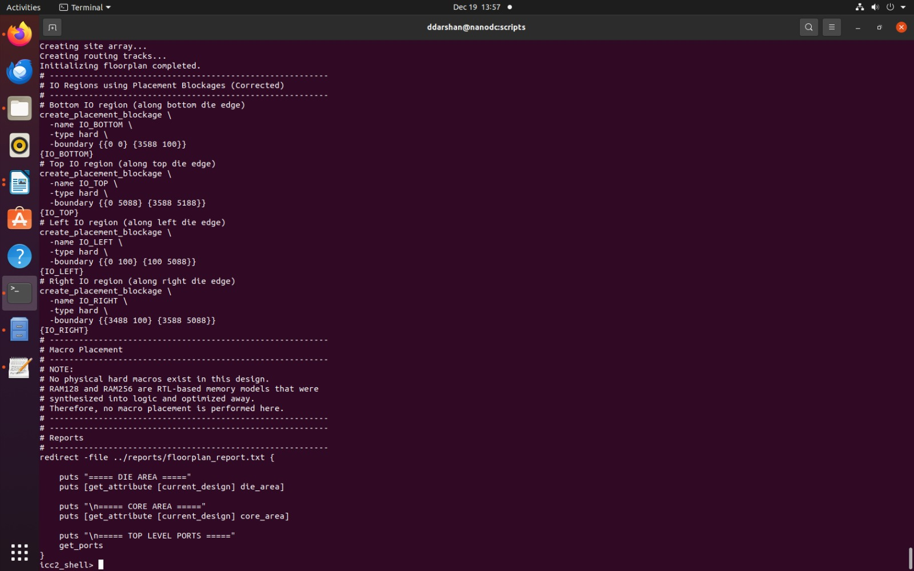
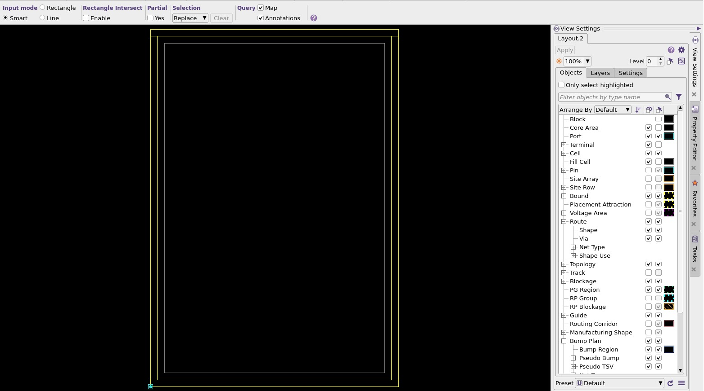
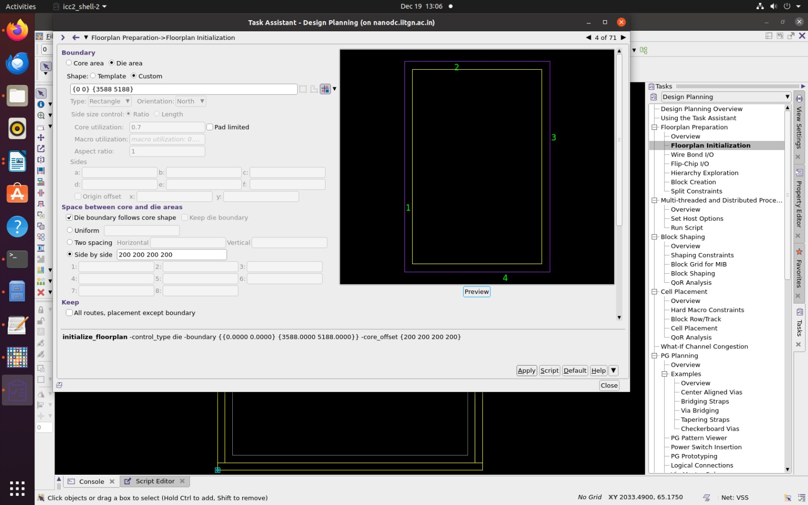
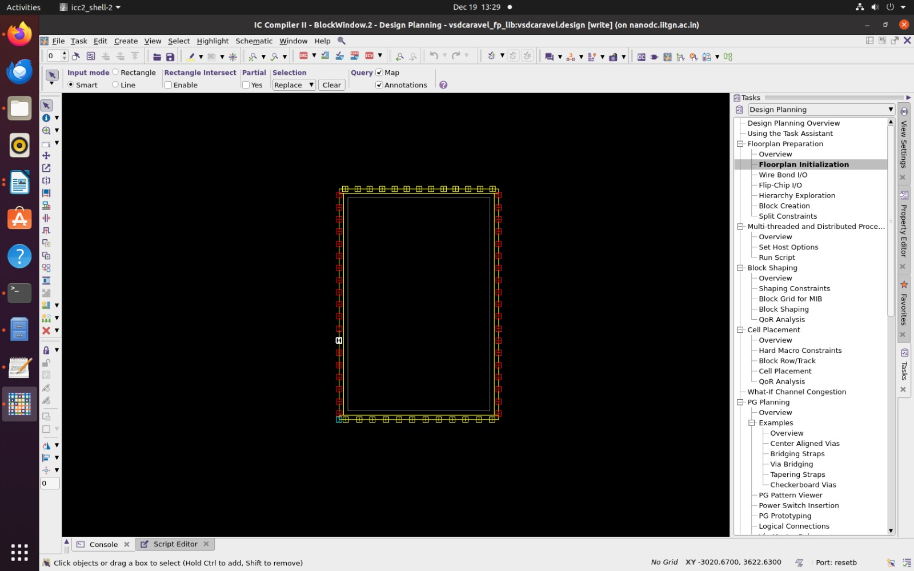
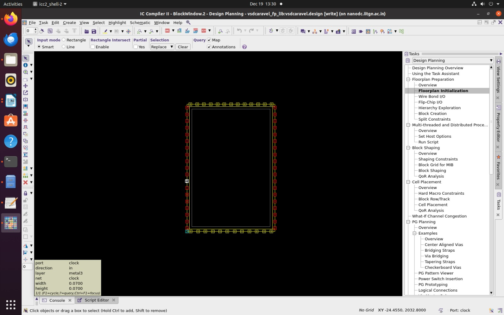
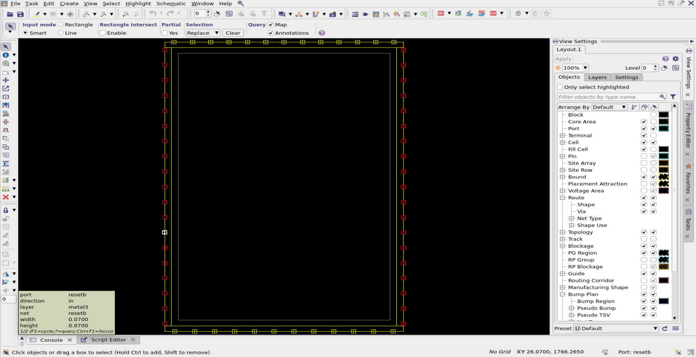
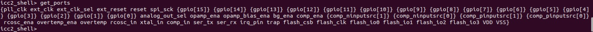
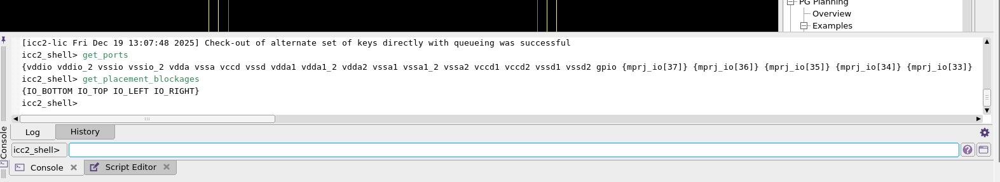

# Task 5: SoC Floorplanning Using ICC2 (Floorplan Only)

## 1. Objective

The objective of this task is to create a **correct and clean SoC-level floorplan** using **Synopsys IC Compiler II (ICC2)**.  
This task focuses on **physical planning fundamentals** rather than implementation details.

Specifically, the goals are to:
- Define an **exact die size**
- Create a **core region with proper margins**
- Ensure **IO accessibility around all four sides**
- Gain hands-on understanding of **ICC2 floorplanning concepts and commands**

This task intentionally stops at the **floorplanning stage** to reinforce correct design abstraction and hierarchy.

---

## 2. Tools Used

- **Tool**: Synopsys IC Compiler II (ICC2)
- **Technology**: SCL 180 nm (SCL180)
- **Input**: Synthesized gate-level netlist of `vsdcaravel`
- **Output**: Floorplan database, reports, and screenshots

## About ICC2 Tool

## Tool Used: IC Compiler II (ICC2)

IC Compiler II (ICC2) is a physical design tool from Synopsys used in the back-end VLSI design flow. It transforms a synthesized netlist into a manufacturable layout by performing floorplanning, placement, clock tree synthesis, routing, and physical optimization. In this work, ICC2 is used specifically for floorplanning, where the core area, macro placement, power planning, and routing resources are defined.

For more details, refer here 👉 [ICC2 Datasheet](https://www.synopsys.com/content/dam/synopsys/implementation&signoff/datasheets/ic-compiler-ii-ds.pdf)

---

## 3. Scope of This Task (Very Important)

### Included
- Die boundary definition
- Core area definition
- IO planning at a conceptual level
- Floorplan visualization
- Reporting and documentation

### Explicitly Excluded
- Standard-cell placement
- Macro placement optimization
- Clock Tree Synthesis (CTS)
- Routing
- Power Delivery Network (PDN)
- Timing closure

**Reason**: Floorplanning is a **planning and architectural stage**, not an optimization or implementation stage.

---

## 4. Design Overview

- **Design Name**: `vsdcaravel`
- **Design Type**: SoC wrapper (Caravel-based)
- **Hierarchy Level**: Top-level SoC integration
- **Internal Blocks**:
  - CPU, peripherals, GPIOs
  - RTL-level RAM modules (RAM128, RAM256)

### Important Note on RAMs
- The RAMs present in Caravel are **Verilog RTL modules** and do **not** have physical abstraction (LEF/LIB).  
- Therefore, they are **not treated as hard macros** during this task.

---

## 5. Technology and Libraries

### Reference Library

A pre-built **NDM (Next Design Model)** reference library is used in ICC2.  
The `.ndm` library is a unified database format that contains all technology and design-related information required for physical implementation.

It includes:
- Technology information
- Routing layers and directions
- Design rules and constraints
- Units and grid definitions (microns)

This enables ICC2 to correctly interpret:
- Physical units and scaling
- Metal stack and routing layers
- Preferred routing directions
- Basic design rules for floorplanning and routing

**Location of the file**

```bash
/home/Synopsys/pdk/SCL_PDK_3/work/run1/icc2_workshop_collaterals/standaloneFlow/work/raven_wrapperNangate/lib.ndm
```
---
## 6. Floorplanning Theory (Conceptual Understanding)

### 6.1 What is Floorplanning?

Floorplanning defines:
- The **chip outline (die)**
- The **region where logic can be placed (core)**
- The **relationship between IOs, core, and power**

It answers questions like:
- How big is the chip?
- Where does logic live?
- Is there space for power and routing?

---

### 6.2 Die Area vs Core Area

- **Die Area**: Entire silicon area
- **Core Area**: Area reserved for standard-cell logic

A margin between die and core is essential for:
- Power rings
- IO routing
- Signal escape
- Reliability

---

## 7. Die Size Definition (Mandatory Requirement)

### Given Requirement
- **Width**: 3.588 mm
- **Height**: 5.188 mm

### Unit Conversion
ICC2 works in **microns**:

3.588 mm = 3588 µm
5.188 mm = 5188 µm

For the floorplanning script, refer here 👉 [floorplan.tcl](floorplan.tcl.md)

### Implemented Die Boundary
```tcl
initialize_floorplan \
  -control_type die \
  -boundary {{0 0} {3588 5188}} \
  -core_offset {200 200 200 200}
```

**This creates:**

- Exact die size
- Uniform core margin of 200 µm on all sides

---

## 8. Core Offset Rational 

**A 200 µm core offset was chosen to:**

- Reserve space for future PDN (rings and straps)
- Allow clean IO-to-core routing
- Avoid congestion near the die edge
- This is a realistic and industry-accepted margin for an SoC of this size.

---
## How to Run Floorplanning

1. Navigate to the floorplanning script directory:

```bash
   cd floorplan/scripts/
```

2. Execute the floorplanning script using ICC2:

```bash
icc2_shell -f floorplan.tcl
```

3. To view the floorplan in the ICC2 GUI:

```bash
start_gui fp_terminal.jpeg
```
After execution, the generated floorplan can be visualized and verified using the ICC2 GUI.




**Screenshot of VSD Caravel SoC Floorplan**

- This is the floorplan area with expected `core area` and reasonable`die area`.






- This screenshot tells us that we used correct `core area`, **Width**: 3.588 mm ,**Height**: 5.188 mm and Uniform core margin of 200 µm on all sides as `die area`.

---

## 9. Aspect Ratio Analysis

```bash
#Formuala
Aspect Ratio = Width / Height
```
- The aspect ratio of our VSD Caravel is

```bash
Aspect Ratio = 3588 / 5188 ≈ 0.69
```

**Interpretation from the Aspect Ratio**

- Rectangular but balanced
- Not too elongated
- Suitable for routing and clock distribution

---

## 10. I/O Planning and Accessibility

- I/O ports are placed around the **die boundary**.
- Pads are:
  - Evenly distributed along all sides
  - Properly oriented
  - Aligned to the die edges (no floating pads)

This ensures good accessibility, uniform signal distribution, and ease of routing during later stages.

⚠️ **Note:** As of now, no exact I/O ordering is maintained.  
This will be refined in later stages; however, the current distribution and correctness of the I/O placement are ensured.


**IO Placement Screenshot**





**VSD Caravel `CLOCK` Port**





**VSD Caravel `Reset` (resetb) Port**  




**IO Visibility**

- All top-level ports are visible using:
```bash
get_ports
```
**VSD Caravel Ports**



**These include:**

- Power and ground ports
- GPIOs
- Clock and reset
- Flash interface signals

**IO Placement Strategy**

- IOs are conceptually distributed on all four sides
- No side is overloaded
- Ports are accessible from the die boundary



- This confirms our `IO pads` are reserved on all four sides.

**Note:**
```bash
Exact pad ordering and pad cells are intentionally not finalized in this task.
```
---

## 11. Why RAMs Are Not Placed as  (Very Important)

**Common PD Rule**

- Macros are placed during floorplanning only if they exist as physical hard macros with LEF.
- In This Design :
  - `RAM128` and `RAM256` are RTL-level Verilog modules
  - No LEF/LIB exists
  - They are part of internal `VSD Caravel` logic.

**Conclusion**

- They are not integration-level macros.
- They are not placed during floorplanning.
- Treating them as macros would break abstraction boundaries.

---

## 12. Macro Spacing Consideration

**Command used:**
```bash
get_cells -hier -filter "is_hard_macro==true"
```

**Result :**  No hard macros detected

**Interpretation**

- Macro spacing is not applicable at this stage.
- This is expected and correct.

---

## 13. Power Feasibility (Conceptual)

- Although PDN is not implemented:
  - Core offset leaves sufficient space for power rings 
  - Power ports (VDD/VSS) are present
  - Floorplan supports future power planning

---

## 16. Why the Flow Stops Here

- This task intentionally stops after floorplanning to ensure:
  - Correct understanding of abstraction
  - No premature optimization
  - Clear separation between planning and implementation
  - Placement, CTS, routing, and PDN belong to later stages of the physical design flow.

---

## 17. Key Learnings

✔ Floorplanning is about architecture, not optimization
✔ Physical abstraction (LEF/LIB) defines what can be placed
✔ Not all RTL blocks are macros
✔ Correct hierarchy understanding is critical in SoC PD

---

## 18. Conclusion

A clean and correct SoC floorplan was successfully created using ICC2, meeting all mandatory requirements:

✅Exact die size
✅Proper core margins
✅IO accessibility
✅Correct abstraction handling

**This task establishes a solid foundation for subsequent physical design stages.**


<p align="center">
🚀 <strong>The design is now ready for the next stage of physical implementation.</strong> 🚀
</p>

---