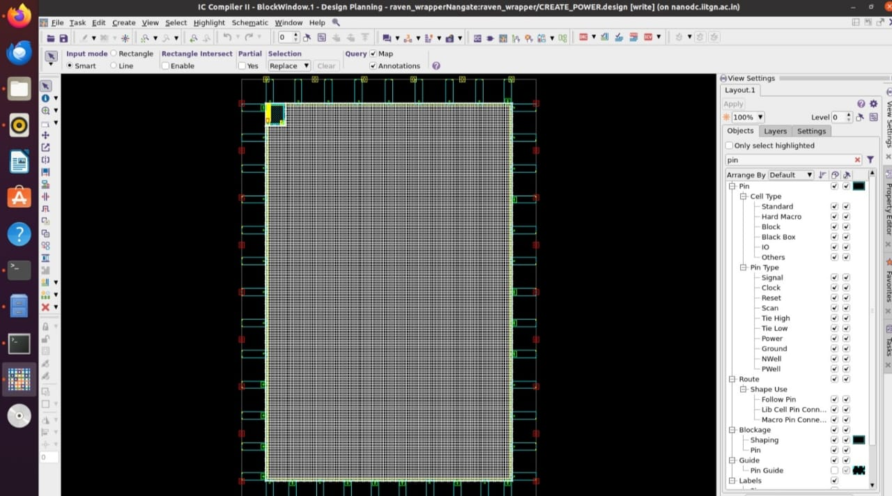
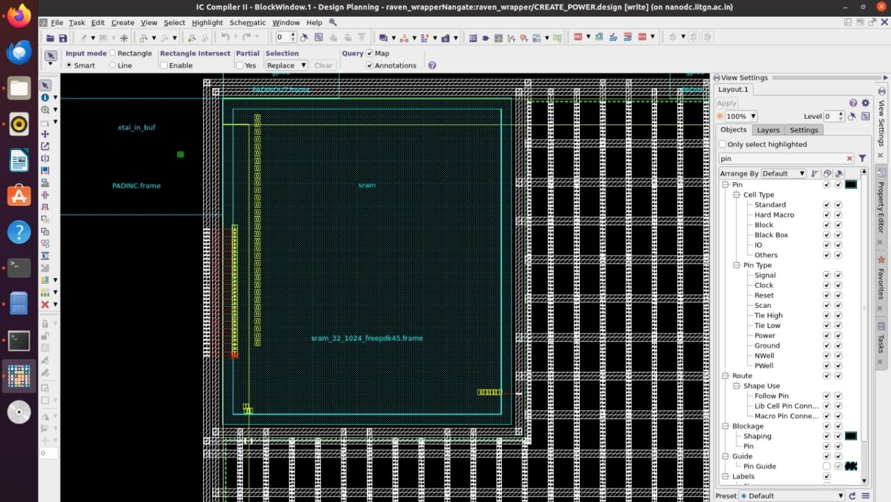
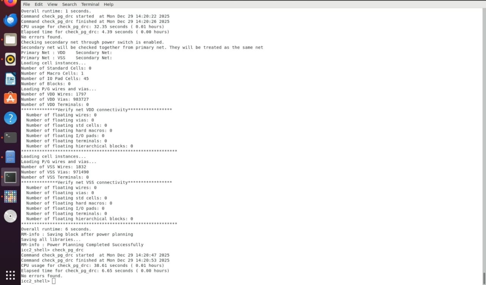
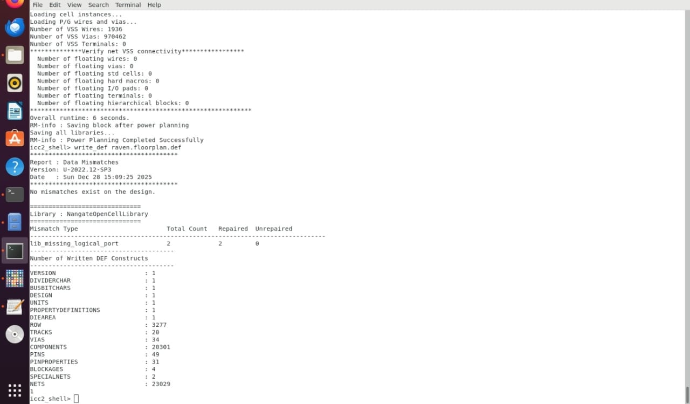
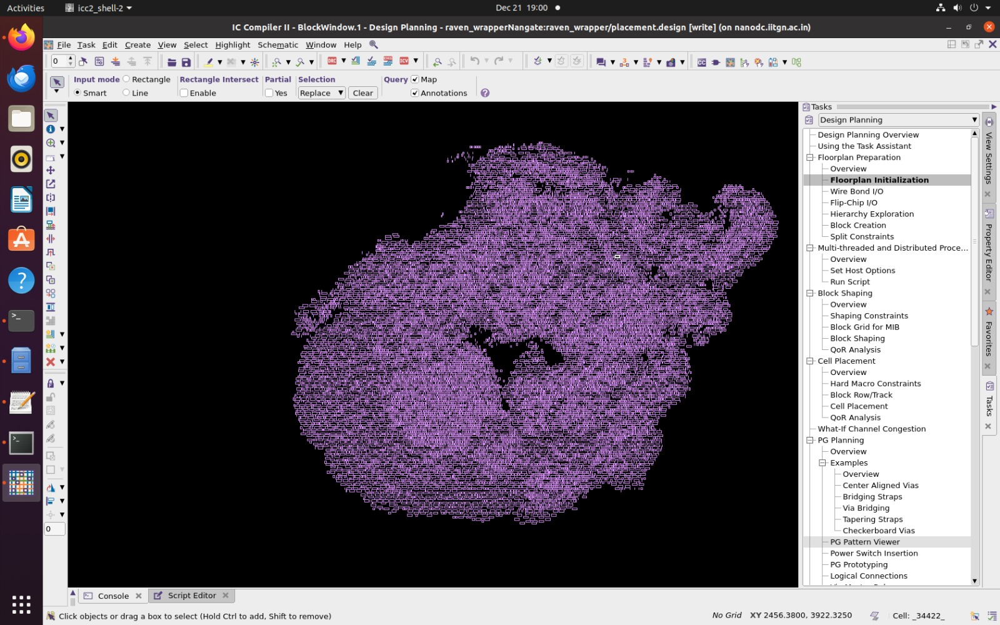
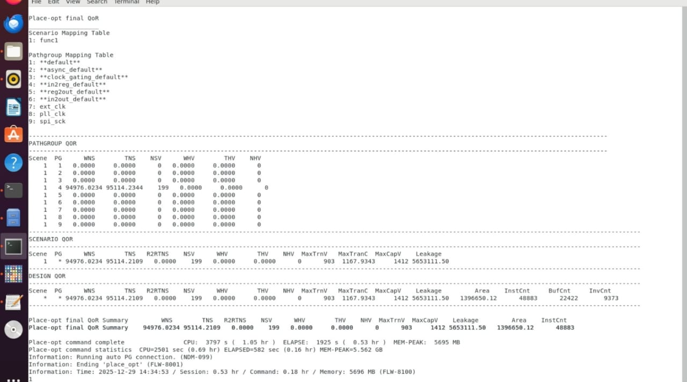
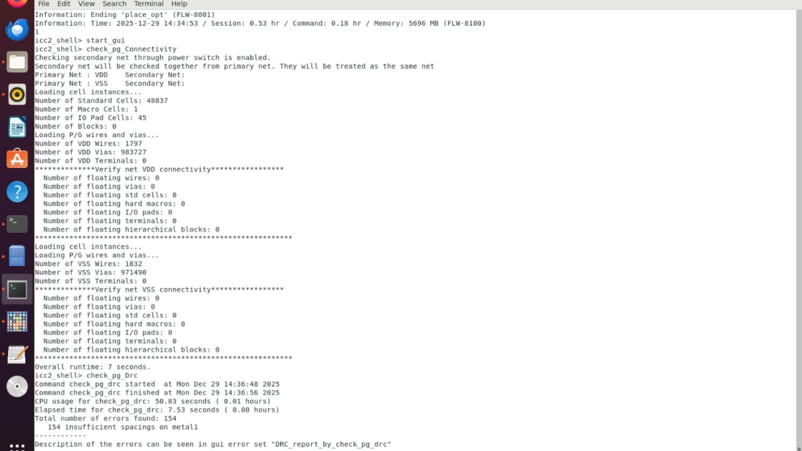

# 🚀 Task 6 — Backend Flow Bring-Up @ 100 MHz  

<p align="center">
  
  
  
  
</p>

---

## 📌 Objective

The objective of **Task-6** is to establish and validate a **complete backend implementation flow** for the Raven SoC wrapper capable of supporting a **100 MHz operating frequency**.

This task demonstrates:
- Correct **tool setup**
- Clean **handoff between backend tools**
- Successful **post-route parasitic extraction**
- Accurate **post-route Static Timing Analysis (STA)**

> ⚠️ This task focuses on **flow correctness**, not timing closure or signoff optimization.

---

<p align="center">
  
</p>

<p align="center">
<em>High-level architecture of the Raven RISC-V SoC</em>
</p>

---
## 🎯 Performance Target

| Parameter | Value |
|--------|-------|
| Target Frequency | **100 MHz** |
| Clock Period | **10 ns** |
| Timing Check | Post-route (SPEF-based STA) |

---
## 🧩 Design Overview

### Design Information

| Attribute | Description |
|--------|------------|
| Design Name | `raven_wrapper` |
| Technology | FreePDK45 (45 nm) |
| Standard Cell Library | Nangate Open Cell Library |
| SRAM Macro | `sram_32_1024_freepdk45` |
| Die Size | 3588 µm × 5188 µm |
| Core Area | 2988 µm × 4588 µm |
| Core Offset | 300 µm |
| Target Clock | 100 MHz (10 ns) |

---
### Metal Stack
- **Routing Layers:** Metal1 - Metal10
- **Power Grid:** Metal9 (Vertical), Metal10 (Horizontal)
- **Standard Cell Rails:** Metal1

| Layer | Direction | Usage |
|-------|-----------|-------|
| Metal1 | Horizontal | Standard cell rails, local routing |
| Metal2 | Vertical | Local routing |
| Metal3 | Horizontal | Macro pin connections |
| Metal4 | Vertical | Signal routing |
| Metal5 | Horizontal | Signal routing |
| Metal6 | Vertical | Signal routing |
| Metal7 | Horizontal | Signal routing |
| Metal8 | Vertical | Signal routing |
| Metal9 | Horizontal | Power mesh (vertical stripes) |
| Metal10 | Vertical | Power mesh (horizontal stripes) |
---
### Clock Specifications
```tcl
# Three clock domains at 100 MHz (10ns period)
- ext_clk:  10.0 ns period
- pll_clk:  10.0 ns period  
- spi_sck:  10.0 ns period
```
---
## Prerequisites

### Required Files
1. **Verilog Netlist:** `raven_wrapper.synth.v`
2. **Technology File:** `nangate.tf`
3. **LEF Files:** Standard cell and SRAM LEF files
4. **Timing Libraries:** `.db` files for standard cells and SRAM
5. **TLU+ Files:** Parasitic extraction models
6. **Constraint Files:** MCMM setup, timing constraints

---
## 🧠 SoC Architecture Overview

<p align="center">
  
</p>

<p align="center">
<em>High-level architecture of the Raven RISC-V SoC</em>
</p>

---
## 🛠 Toolchain Used

| Stage | Tool |
|-----|-----|
| Placement & Routing | Synopsys ICC2 |
| Parasitic Extraction | Synopsys Star-RC |
| Static Timing Analysis | Synopsys PrimeTime |

---

## 🔁 Backend Flow Sequence

```text
ICC2 (Placement + CTS + Routing)
        ↓
Star-RC (SPEF Extraction)
        ↓
PrimeTime (Post-Route STA @ 100 MHz)
```
---
## Design Setup

```bash
# clone the repository
git clone https://github.com/kunalg123/icc2_workshop_collaterals
```
### 1. Common Setup Script (`icc2_common_setup.tcl`)

- This script defines all global variables and paths required for the design.

## 🔧 Global Design Configuration Script

- This configuration file serves as the **central initialization script** for the physical design flow.  
- It defines the **design identity**, **library associations**, **input file paths**, and **routing layer constraints** required before starting ICC2 execution.

---

### 🏷 Design Identification Parameters

These variables uniquely identify the design and its associated working library.

```tcl
set DESIGN_NAME        "raven_wrapper"
set LIBRARY_SUFFIX     "Nangate"
set DESIGN_LIBRARY     "${DESIGN_NAME}${LIBRARY_SUFFIX}"
```

**Purpose:**

- Establishes a unique design name
- Creates a consistent naming convention for the ICC2 design library
- Avoids conflicts when multiple designs are loaded in the same workspace

---
### 📚 Reference Library Definition

- The following LEF files are used to describe the physical layout characteristics of standard cells and embedded macros.

```tcl
set REFERENCE_LIBRARY [list \
    /path/to/nangate_stdcell.lef \
    /path/to/sram_32_1024_freepdk45.lef
]
```

**Purpose:**

- Provides cell geometry, pin locations, and obstruction data
- Enables correct placement and routing
- Allows ICC2 to understand both standard cells and SRAM macros

---
### 📥 Design Input Files

- These inputs define the logical design, technology rules, and timing/parasitic setup.

```tcl
set VERILOG_NETLIST_FILES        "/path/to/raven_wrapper.synth.v"
set TECH_FILE                   "/path/to/nangate.tf"
set TCL_MCMM_SETUP_FILE         "./init_design.mcmm_example.auto_expanded.tcl"
set TCL_PARASITIC_SETUP_FILE    "./init_design.read_parasitic_tech_example.tcl"
```

**Purpose:**

- Loads the synthesized RTL netlist
- Applies foundry-specific technology constraints
- Enables MCMM (Multi-Corner Multi-Mode) timing analysis
- Prepares parasitic extraction settings for later stages

---
### 🧱 Routing Layer Strategy

- This section defines the preferred routing direction for each metal layer and limits the routing stack.

```
set ROUTING_LAYER_DIRECTION_OFFSET_LIST \
    "{metal1 horizontal} {metal2 vertical} \
     {metal3 horizontal} {metal4 vertical} \
     {metal5 horizontal} {metal6 vertical} \
     {metal7 horizontal} {metal8 vertical} \
     {metal9 horizontal} {metal10 vertical}"

set MIN_ROUTING_LAYER "metal1"
set MAX_ROUTING_LAYER "metal10"
```

**Purpose:**

- Enforces alternating routing directions to reduce congestion
- Matches standard industry routing practices
- Ensures routers use only valid metal layers
- Provides compatibility with power grid planning

---
### Phase 1: Floorplanning 🧭

#### Purpose

The floorplanning phase establishes the **physical foundation** of the design by defining the die, core, IO boundaries, and macro placement. All subsequent backend stages depend on the correctness of this step.

---
#### Scope of Work

During this phase, the following were completed:

- ✔ Die and core dimension definition  
- ✔ Core offset and utilization planning  
- ✔ IO pad placement on all four sides  
- ✔ SRAM macro placement with orientation control  
- ✔ Macro halos and placement blockages  
- ✔ Core-edge keepout regions  

This ensured a **routing-aware, power-aware, and congestion-safe** physical structure before advancing to power planning.

---
#### Detailed Floorplan Documentation 📐

> 🔍 **Note:**  
> A **complete, step-by-step floorplanning explanation** — including scripts, placement visuals, reports, and execution logs — is documented in detail here:

👉 **Refer to:**  
📐 [Phase-1: Floorplanning ](../Task-5_Floorplan_ICC2/Readme.md)

#### Outcome

- Floorplan validated with no critical DRC violations  
- Clean handoff achieved for power planning  
- Design marked **placement-ready**  

---
### Phase 2: Power Planning

#### Purpose

The power planning stage defines a robust **power delivery infrastructure** that guarantees reliable VDD/VSS distribution across the entire chip. The intent of this phase is to ensure that all logic elements receive stable power with minimal voltage degradation, while maintaining manufacturability and routing efficiency.

#### Key Objectives

- Establish uninterrupted **power and ground connectivity** from pads to standard cells  
- Maintain voltage drop within acceptable margins  
- Construct core-level **power rings**  
- Distribute power using **multi-layer mesh structures**  
- Provide sufficient **via density** between metal layers  

---

#### Power Distribution Architecture

The power delivery network spans multiple routing layers, each serving a defined role:

- **Metal1 (M1):** Integrated standard-cell power rails  
- **Metal2 (M2):** Vertical power connections from cell rails  
- **Metal9–Metal10:** High-capacity global power mesh  

---

#### Power Ring Configuration

A closed-loop power ring was created around the core boundary to act as the primary interface between IO power pads and the internal mesh.

- Ring width: 4–6 µm per net  
- Ring offset: ~10 µm from core boundary  
- Dedicated VDD and VSS conductors  

---

#### Power Mesh Strategy

To ensure uniform current distribution, a dual-layer mesh was implemented:

- **Metal9:** Vertical stripes (alternating VDD/VSS)  
- **Metal10:** Horizontal stripes (alternating VDD/VSS)  
- Typical pitch: ~50 µm  
- Stripe width: ~2 µm  

This configuration ensures coverage across the entire core area while minimizing routing congestion.

---

#### Via Connectivity Plan

Inter-layer connectivity was achieved using strategically placed vias:

- M1 ↔ M2: Standard cell rail connections  
- M2 ↔ M3: Intermediate routing transitions  
- M8 ↔ M9: Entry into global mesh  
- M9 ↔ M10: Cross-layer mesh reinforcement  
- Typical via spacing: 5–10 µm  

---

#### Power Planning Implementation

**Power grid generation was scripted using ICC2 as shown below:**

```tcl
create_pg_region -name PG_CORE \
   -region {{core_x1 core_y1} {core_x2 core_y2}}

create_pg_strategy -name pg_mesh_strategy \
   -layers {metal9 metal10} \
   -stripe_width {2.0 2.0} \
   -stripe_pitch {50 50}

create_pg_pattern -name VDD_pattern \
   -strategy pg_mesh_strategy \
   -net VDD

create_pg_pattern -name VSS_pattern \
   -strategy pg_mesh_strategy \
   -net VSS

compile_pg
```
---
#### Power Grid Validation

Power grid correctness was verified by:

*   Ensuring all power pads connected to rings
*   Checking for floating PG segments 
*   Confirming continuity from pads to standard cells
    






---
**Screenshot** : Power Planning log



---
#### IR Drop Considerations

Key factors evaluated during power integrity review:

*   Worst-case IR drop near core corners
*   Impact of cell density on local current demand  
*   Mesh pitch vs voltage stability trade-offs
    

**Acceptance target:**

```bash
 IR drop ≤ 5% of nominal supply voltage
```
---
#### Power Planning Outputs

*   raven\_wrapper.post\_power.def — DEF with power geometry
*   PG reports covering mesh coverage and connectivity
*   Block savepoint: post\_power
    
The generated DEF was later reused as an input reference for **DC\_Topo synthesis alignment**.
    
**Screenshot** : Power Planning log



---
### Phase 3: Standard Cell Placement

#### Purpose

The placement phase translates the synthesized netlist into a physically realizable layout by positioning over **45,000 standard cells** within the defined core while respecting timing, congestion, and density constraints.

---
#### Placement Objectives

*   Optimize **critical path proximity**
*   Maintain balanced cell distribution
*   Control routing congestion
*   Minimize overall wirelength  
*   Ensure legal, site-aligned placement

---
#### Initial Placement

Placement was initiated using ICC2’s hierarchical placement engine:

*   Cell snapping aligned to site grids
*   Target utilization: ~65%
*   Fixed macros treated as placement obstacles
*   IO-aware proximity optimization

---
#### Placement Optimization

Final refinement was performed using:
```bash
place_opt
```

This stage involved:

1.  Timing-driven cell movement
2.  Automatic hold-fix buffer insertion
3.  Setup-path optimization through cell resizing
4.  Legalization and placement cleanup
    
---
#### Cell Composition

Approximate cell composition across the core:

| Category            | Approx. Share |
| ------------------- | ------------- |
| Combinational logic | ~40%          |
| Flip-flops          | ~20%          |
| Buffers & drivers   | ~15%          |
| Specialized cells   | ~25%          |

---
#### Density and Congestion Control

*   Higher density near SRAM macro
*   Moderate density across logic regions
*   Reduced density near IO boundaries
    
Congestion estimation tools highlighted routing pressure zones, allowing early visibility into potential routing risks.

---
#### Placement Visualization

The final placement view confirms:

*   Uniform distribution of logic
*   Clean macro boundaries
*   Adequate whitespace for routing

**Screenshot** : Placement of Standard cells



---
### Placement Execution Log

The placement process generates logs showing cell placement statistics, optimization iterations, quality of results metrics, and convergence information.





---
#### Placement Outputs

*   raven\_wrapper.post\_place.def — Placed DEF
*   raven\_wrapper.post\_place.v — Updated netlist
*   Reports:
    *   report\_placement.rpt
    *   report\_qor.rpt
    *   report\_congestion.rpt
*   Block savepoint: post\_place

---
## Engineering Transition — RTL Debug Track

- To avoid blocking overall project progress, the team workflow was strategically split:
        - PD Track: Continued investigation of PG and routing issues
        - RTL Debug Track: Deep RTL-level analysis and verification
- I transitioned to the RTL Debug Track, where I contributed to:
        - Wishbone protocol correctness
        - GPIO architecture and reset behavior
        - POR-free reset migration
        - External reset buffering validation
        - RTL ↔ GLS equivalence checking
        - SoC wrapper integration correctness
- This ensured the functional integrity of the design before proceeding further in backend stages.

---