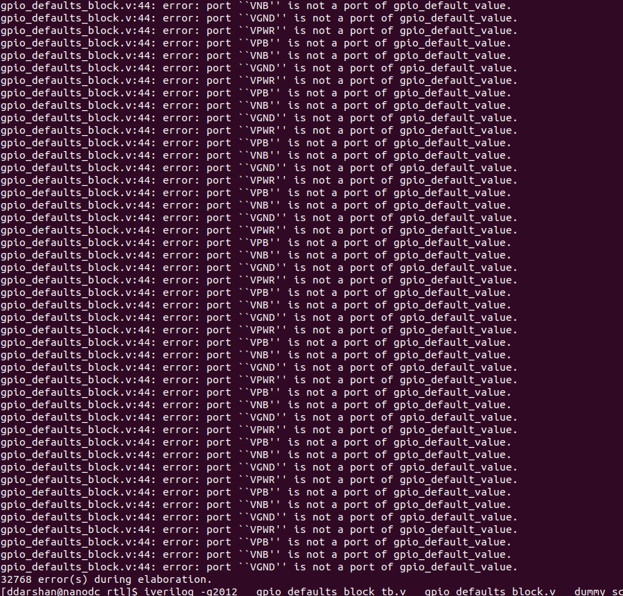
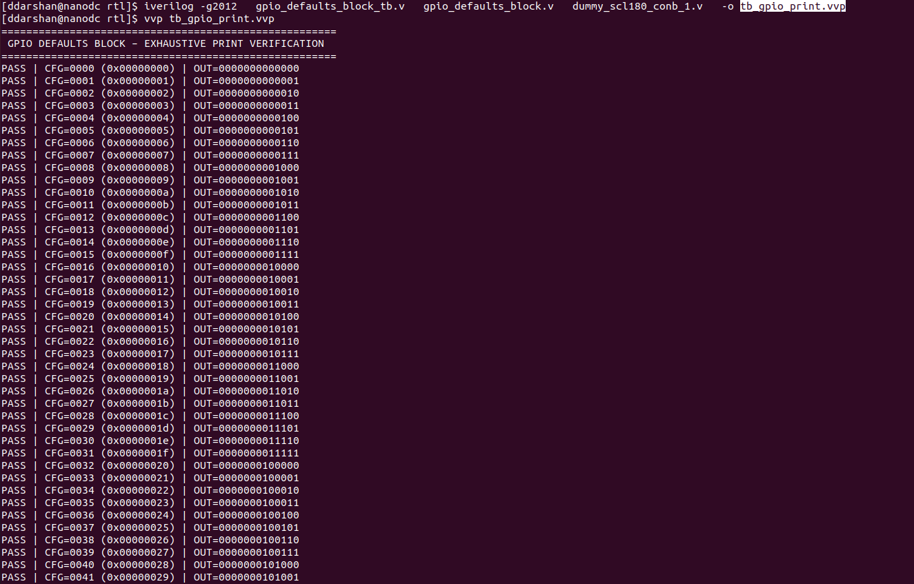
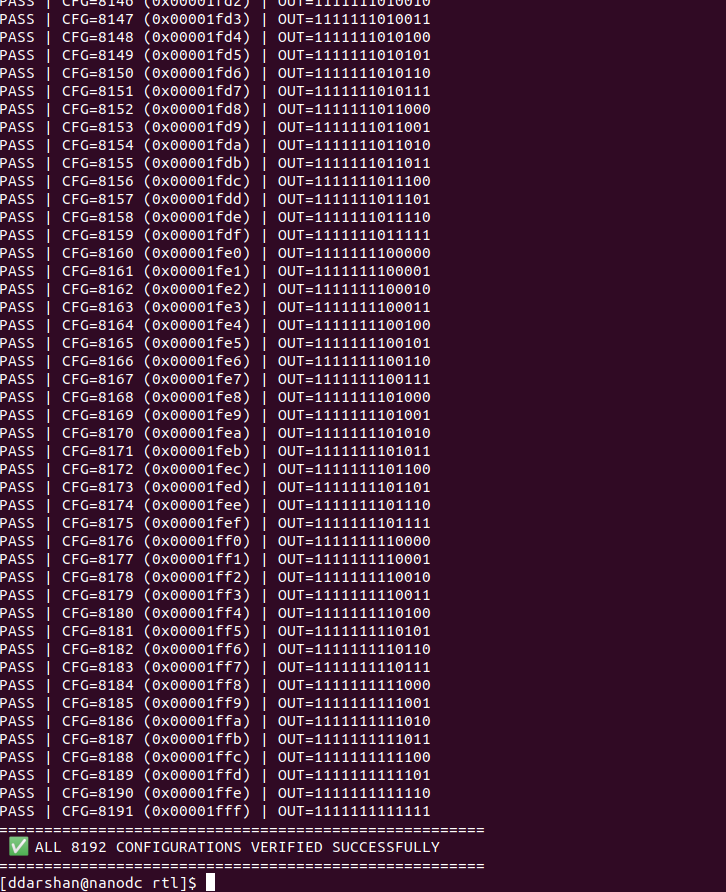

# GPIO Defaults Block — Constant-Based Pad Configuration
## Refractored by : Divya Darshan VR
## Module: gpio_defaults_block.v

### Overview

- `gpio_defaults_block` generates a **fixed 13-bit GPIO configuration vector** used to initialize GPIO pads at power-up.
- The configuration value is supplied as a **compile-time parameter** (`GPIO_CONFIG_INIT`).
- Each configuration bit is driven using **technology constant cells**, not RTL constants.
- This ensures **deterministic, silicon-safe behavior** without relying on POR logic or implicit power-up assumptions.

This block is used during **GPIO bring-up** to guarantee a safe default state for pads.

---

## Design Intent

- Avoid RTL literals (`1'b0`, `1'b1`) for pad configuration
- Use **physical tie-high / tie-low cells**
- Support:
  - RTL simulation
  - Power-aware simulation
  - GLS
  - P&R / LVS

---

## Interface Summary

### Parameters

| Parameter | Width | Description |
| --------- | ----- | ----------- |
| `GPIO_CONFIG_INIT` | 13 | Default GPIO pad configuration word |

### Ports

| Signal | Direction | Description |
| ----- | --------- | ----------- |
| `gpio_defaults[12:0]` | Output | Constant GPIO configuration vector |

### Optional Power Pins

| Signal | Direction | Description |
| ----- | --------- | ----------- |
| `VPWR` | Inout | Core power |
| `VGND` | Inout | Ground |
| `VPB`  | Inout | P-well bias |
| `VNB`  | Inout | N-well bias |

> Power pins are **conditionally included** using `USE_POWER_PINS`.

---

## Internal Architecture

- For each GPIO configuration bit:
  - A **constant-high** signal
  - A **constant-low** signal
- Bit selection is done using a compile-time parameter comparison.

```text
GPIO_CONFIG_INIT[i]
        |
        v
  +------------------+
  | Select HI or LO  |
  +------------------+
        |
        v
gpio_defaults[i]
```
---
## Constant Cell Modeling

### Module: `dummy_scl180_conb_1`

```verilog
module dummy_scl180_conb_1 (
`ifdef USE_POWER_PINS
    inout VPWR,
    inout VGND,
    inout VPB,
    inout VNB,
`endif
    output wire HI,
    output wire LO
);
    assign HI = 1'b1;
    assign LO = 1'b0;
endmodule
```
---
### Purpose

- Models an SCL180 constant logic cell (tie-high / tie-low)
- Provides physically realizable constant values for silicon
- Used by gpio_defaults_block to generate deterministic GPIO pad defaults

---
### Power Pin Handling

- Power pins (VPWR, VGND, VPB, VNB) are conditionally exposed
- Controlled using the compile-time macro USE_POWER_PINS
- This allows the same RTL to be used across:
	- Simple RTL simulation
	- Power-aware RTL
	- Gate-level simulation (GLS)
	- Physical implementation flows

---
### Previous Issue (Resolved)

- An earlier version of this module incorrectly used:
```bash
`ifndef USE_POWER_PINS
```

- to guard the power pins.

### Why This Was a Problem

- In default RTL simulation, USE_POWER_PINS is not defined
- Using ifndef caused power pins to be included unintentionally
- The parent module (gpio_defaults_block) instantiated the constant cell assuming a power-pin–optional interface
- This resulted in port mismatch errors during elaboration, reported as:
	- Missing or unexpected VPWR, VGND, VPB, VNB ports
	- Repeated errors due to array instantiation of the cell


**Proof**



---
### Final (Correct) Behavior

Using:
```bash
`ifdef USE_POWER_PINS
```

- ensures that:

| Flow Type              | Power Pins Present |
| ---------------------- | ------------------ |
| Default RTL simulation | ❌ No               |
| Power-aware RTL        | ✅ Yes              |
| GLS / P&R / LVS        | ✅ Yes              |

- This matches industry-standard conventions and avoids interface mismatches.

### Key Takeaway

- Power pins are an explicit opt-in feature.
- Using ifdef USE_POWER_PINS ensures clean RTL simulation by default while preserving compatibility with power-aware and physical design flows.

### Simulation Output

**RTL SIMULATION**







---
## Summary
### Module: `gpio_defaults_block.v` / `dummy_scl180_conb_1.v`

### Current Status
- The GPIO defaults logic is **functionally correct and verified**.
- GPIO pad configuration values are generated using **technology-accurate constant cells**.
- The design avoids RTL literals and does not rely on any POR-based behavior.
- The module compiles cleanly in both:
  - Default RTL simulation
  - Power-aware simulation flows

### Identified Issue (Legacy / Initial Implementation)
- An interface mismatch was identified in the constant cell model:
  - Power pins were previously guarded using `ifndef USE_POWER_PINS`
  - This caused **unexpected power pins to appear in default RTL simulation**
  - Resulted in **port mismatch elaboration errors**, amplified by array instantiation of the cell

### Implemented Fix
- Power pin handling was corrected by switching to:
  - `ifdef USE_POWER_PINS`
- This makes power pins an **explicit opt-in feature**, aligned with industry convention.
- The constant cell model now:
  - Matches real SCL180 cell interfaces
  - Supports power-aware flows without breaking RTL simulation
  - Eliminates port mismatch errors

### Verification Status

| Item | Status |
|----|----|
| Constant cell modeling | ✅ Verified |
| Power pin interface | ✅ Corrected |
| Default RTL simulation | ✅ Passed |
| Power-aware compile (`USE_POWER_PINS`) | ✅ Passed |

---


