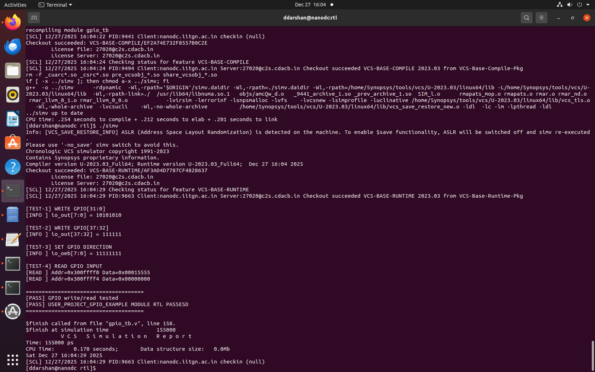

# VSD Caravel
## Refractored by : Divya Darshan VR
## user_project_gpio_example.v — GPIO Wishbone Control Block


### Overview

- `user_project_gpio_example.v` implements a Wishbone-controlled GPIO block for user projects in the Caravel / VSD SoC environment.
- It allows software to:
	- Drive GPIO outputs
	- Configure GPIO direction (input/output)
	- Read GPIO input values
- This module is primarily intended for GPIO validation and bring-up.

### GPIO Organization

| GPIO Range    | Description |
| ------------- | ----------- |
| `GPIO[31:0]`  | Lower GPIOs |
| `GPIO[37:32]` | Upper GPIOs |

- Total GPIOs: 38

---
## Interface Summary
### Clock & Reset

| Signal     | Direction | Description       |
| ---------- | --------- | ----------------- |
| `wb_clk_i` | Input     | Wishbone clock    |
| `wb_rst_i` | Input     | Active-high reset |

### Wishbone Interface

| Signal            | Direction | Description          |
| ----------------- | --------- | -------------------- |
| `wbs_cyc_i`       | Input     | Cycle valid          |
| `wbs_stb_i`       | Input     | Strobe               |
| `wbs_we_i`        | Input     | Write enable         |
| `wbs_sel_i[3:0]`  | Input     | Byte select          |
| `wbs_adr_i[31:0]` | Input     | Address              |
| `wbs_dat_i[31:0]` | Input     | Write data           |
| `wbs_dat_o[31:0]` | Output    | Read data            |
| `wbs_ack_o`       | Output    | Transfer acknowledge |

### GPIO Interface

| Signal   | Direction | Description                           |
| -------- | --------- | ------------------------------------- |
| `io_in`  | Input     | GPIO input pins                       |
| `io_out` | Output    | GPIO output values                    |
| `io_oeb` | Output    | Output enable (1 = input, 0 = output) |

### Register Map

| Address      | Register | Access | Description           |
| ------------ | -------- | ------ | --------------------- |
| `0x300FFFF0` | `io_l`   | R/W    | GPIO[31:0] output     |
| `0x300FFFF4` | `io_h`   | R/W    | GPIO[37:32] output    |
| `0x300FFFEC` | `oeb_l`  | R/W    | GPIO[31:0] direction  |
| `0x300FFFE8` | `oeb_h`  | R/W    | GPIO[37:32] direction |

---
## Functional Behavior

### Write Transactions

- Controlled by Wishbone write cycle
- Byte enables (wbs_sel_i) respected
- Upper GPIO registers (io_h, oeb_h) use only valid bits

### Read Transactions

- Reads return:
	- io_in for GPIO state
	- io_oeb for direction state

### SIMULATION OUTPUTS

**RTL SIMULATION**




---
## user_project_gpio_example.v — Proposed GPIO Direction Fix (Under Verification)

###Background

- During GPIO module review, a width mismatch issue was identified in the legacy RTL related to upper GPIO direction bits (oeb_h).

---
### Legacy Behavior (Active)

```bash
oeb_h[7:0]    <= ...
oeb_h[15:8]   <= ...
oeb_h[23:16]  <= ...
oeb_h[31:24]  <= ...
```
---
### Problem

- oeb_h is declared as:
```bash
reg [7:0] oeb_h;
```

- Writing bits beyond [7:0]:
	- Is out-of-range
	- Silently ignored by simulators
	- Can mislead readers and reviewers

**Despite this:**

- ✔ Simulation passes
- ✔ Testbench passes
- ✔ No functional crash

---
## Proposed (Commented) Fix

```bash
// FIXED LOGIC (UNDER VERIFICATION)
// Only valid bits [5:0] are written
if ((wbs_adr_i == 32'h300FFFE8) && wbs_sel_i[0]) begin
    oeb_h <= wbs_dat_i[5:0];
end
```
---
### What This Fix Improves

| Aspect            | Legacy      | Proposed |
| ----------------- | ----------- | -------- |
| Width correctness | ❌           | ✅        |
| Readability       | ❌ Confusing | ✅ Clear  |
| Synth safety      | ⚠️          | ✅        |
| Behavior change   | None        | None     |

-➡️ Functional behavior remains identical

**Why It Is Commented**

- Per mentor instruction:
	- ❌ Do not remove legacy logic
	- ❌ Do not silently change behavior
	- ✅ Keep fix documented
	- ✅ Enable only after review

## Verification Status

| Item                | Status        |
| ------------------- | ------------- |
| Legacy RTL          | ✅ Verified    |
| Proposed fix        | ❌ Not enabled |
| Same TB reuse       | ⚠️ Planned    |
| Waveform comparison | ⚠️ Planned    |

### NOTE

- The legacy logic remains authoritative.
- The proposed fix is documented for clarity and future cleanup,pending formal verification sign-off.

---
## Summary
### Module: `user_project_gpio_example.v`

### Current Status
- The legacy RTL implementation is **functionally correct and verified**.
- GPIO write, read, and direction control operations behave as expected.
- The module passes simulation using both Icarus Verilog and Synopsys VCS.

### Identified Issue (Legacy Behavior)
- A **width-mismatch issue** exists in the upper GPIO direction register (`oeb_h`):
  - `oeb_h` is only **6 bits wide**
  - Legacy code attempted **32-bit writes**
  - Simulators silently ignore out-of-range bits, masking the issue

### Proposed Fix (Documented Only)
- A width-safe write mechanism was identified:
  - Restricts writes to valid bits `[5:0]`
  - Improves code clarity and synthesis safety
- As per mentor guidance:
  - Legacy RTL remains **active and untouched**
  - Fixed logic is **commented and documented**
  - No functional behavior is changed
---
### SIMULATION OUTPUTS

**RTL SIMULATION FOR PROPOSED SOLUTION**


---
### Verification Status
| Item | Status |
|----|----|
| Legacy RTL | ✅ Verified |
| Proposed fix | 📝 Documented |
| Enabled in RTL | ❌ No |
| Regression tested | ⏳ Planned |

---

